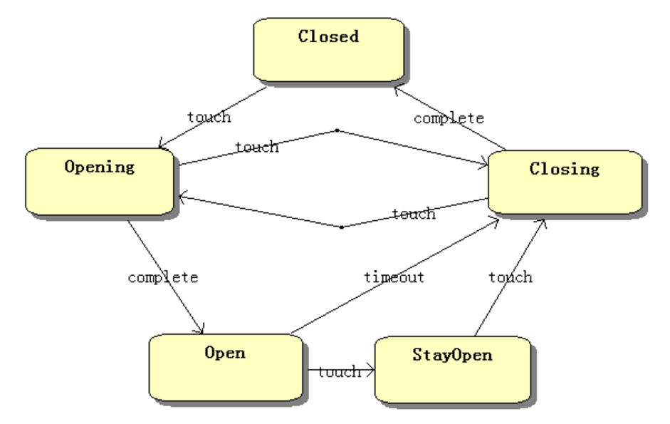

# 设计模式

##    1. 单一职责原则 

定义：不要存在多于一个导致类变更的原因。通俗的说，即一个类只负责一项职责。

问题由来：类T负责两个不同的职责：职责P1，职责P2。当由于职责P1需求发生改变而需要修改类T时，有可能会导致原本运行正常的职责P2功能发生故障。

解决方案：遵循单一职责原则。分别建立两个类T1、T2，使T1完成职责P1功能，T2完成职责P2功能。这样，当修改类T1时，不会使职责P2发生故障风险；同理，当修改T2时，也不会使职责P1发生故障风险。

e.g. 猪牛羊鱼 呼吸

## 2. 里氏替换原则 

定义1：如果对每一个类型为 T1的对象 o1，都有类型为 T2 的对象o2，使得以 T1定义的所有程序 P 在所有的对象 o1 都代换成 o2 时，程序 P 的行为没有发生变化，那么类型 T2 是类型 T1 的子类型。

定义2：所有引用基类的地方必须能透明地使用其子类的对象。

问题由来：有一功能P1，由类A完成。现需要将功能P1进行扩展，扩展后的功能为P，其中P由原有功能P1与新功能P2组成。新功能P由类A的子类B来完成，则子类B在完成新功能P2的同时，有可能会导致原有功能P1发生故障。

解决方案：当使用继承时，遵循里氏替换原则。类B继承类A时，除添加新的方法完成新增功能P2外，尽量不要重写父类A的方法，也尽量不要重载父类A的方法。

子类不要对父类按规范写好的非抽象方法进行重写，重载

## 3. 依赖倒置原则

定义：高层模块不应该依赖低层模块，二者都应该依赖其抽象；抽象不应该依赖细节；细节应该依赖抽象。

问题由来：类A直接依赖类B，假如要将类A改为依赖类C，则必须通过修改类A的代码来达成。这种场景下，类A一般是高层模块，负责复杂的业务逻辑；类B和类C是低层模块，负责基本的原子操作；假如修改类A，会给程序带来不必要的风险。

解决方案：将类A修改为依赖接口I，类B和类C各自实现接口I，类A通过接口I间接与类B或者类C发生联系，则会大大降低修改类A的几率。

e.g. 讲故事，讲新闻

## 4. 接口隔离原则

定义：客户端不应该依赖它不需要的接口；一个类对另一个类的依赖应该建立在最小的接口上。

问题由来：类A通过接口I依赖类B，类C通过接口I依赖类D，如果接口I对于类A和类B来说不是最小接口，则类B和类D必须去实现他们不需要的方法。

解决方案：将臃肿的接口I拆分为独立的几个接口，类A和类C分别与他们需要的接口建立依赖关系。也就是采用接口隔离原则。

## 5. 迪米特法则

定义：一个对象应该对其他对象保持最少的了解。

问题由来：类与类之间的关系越密切，耦合度越大，当一个类发生改变时，对另一个类的影响也越大。

解决方案：尽量降低类与类之间的耦合。

e.g. 总公司，分公司 打印人员ID

## 6. 开闭原则

定义：一个软件实体如类、模块和函数应该对扩展开放，对修改关闭。

问题由来：在软件的生命周期内，因为变化、升级和维护等原因需要对软件原有代码进行修改时，可能会给旧代码中引入错误，也可能会使我们不得不对整个功能进行重构，并且需要原有代码经过重新测试。

解决方案：当软件需要变化时，尽量通过扩展软件实体的行为来实现变化，而不是通过修改已有的代码来实现变化。

------

## 单例模式

定义：保证一个类仅有一个实例，并提供一个访问它的全局访问点。

------

## 观察者模式

又被称为发布（publish ）-订阅（Subscribe）模式、模型-视图（View）模式、源-收听者(Listener)模式或从属者模式

一个目标对象可以注册多个观察者，当目标对象的状态改变的时候，可以通知观察者对象作出相应的响应。

\1. 概述

　　有时被称作发布/订阅模式，观察者模式定义了一种一对多的依赖关系，让多个观察者对象同时监听某一个主题对象。这个主题对象在状态发生变化时，会通知所有观察者对象，使它们能够自动更新自己。

\2. 解决的问题

　　将一个系统分割成一个一些类相互协作的类有一个不好的副作用，那就是需要维护相关对象间的一致性。我们不希望为了维持一致性而使各类紧密耦合，这样会给维护、扩展和重用都带来不便。观察者就是解决这类的耦合关系的。

------

## 状态机模式

\1. 概述

 The intent of the STATE pattern is to distribute state-specific logic across classes that represent an object’s state.

 STATE 设计模式的目的 是：将特定状态相关的逻辑分散到一些类的状态类中。

\2. 模式的组成

环境类（Context）: 定义客户感兴趣的接口。维护一个ConcreteState子类的实例，这个实例定义当前状态。

抽象状态类（State）: 定义一个接口以封装与Context的一个特定状态相关的行为。

具体状态类（ConcreteState）: 每一子类实现一个与Context的一个状态相关的行为。

e.g. 旋转门

