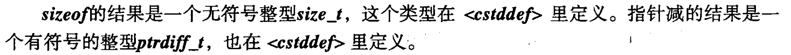
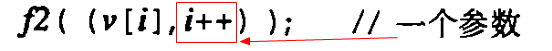
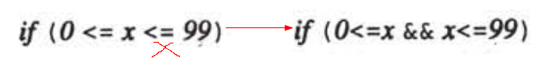
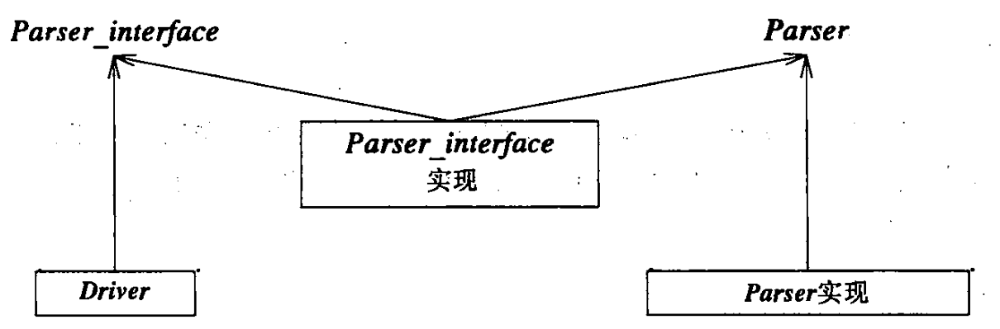
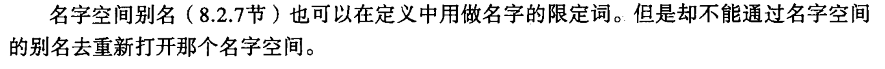
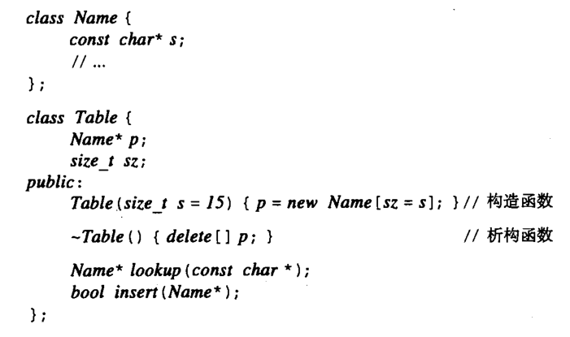
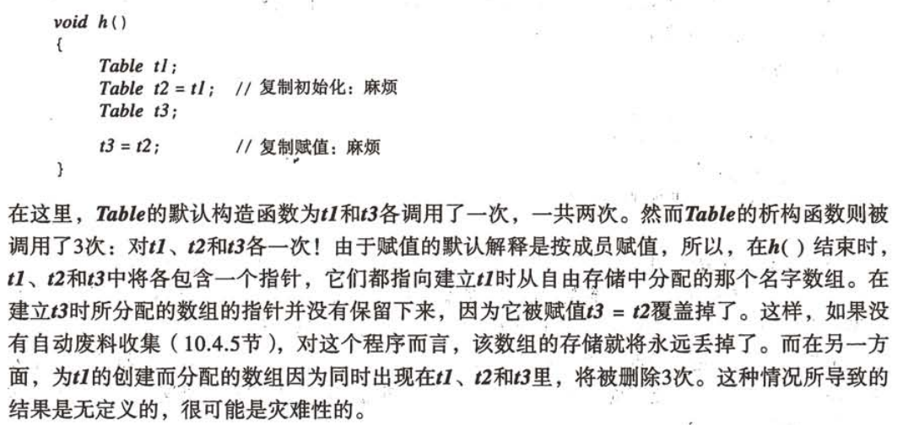

# Problems in C++程序设计语言 特别版

------

1. 第一部分 基本功能

   1. size_t

   

   1. x++ 不是一个左值 结果可能为x或x+1

   1. 逗号

   

   1. 连续大小比较

   

   1. 只能对那些排列在最后的参数提供默认参数

   1. ...

   1. 相同名字的空间定义，多重界面  组合和选择

   

   1. 抛异常p198

   ------

   第二部分 抽象机制

   1. 类与结构的复制

   1. 对象的复制 p249

   

   1. 成员复制 P252

   1. P247 填坑吧。。