# C++程序设计语言 特别版

------

第一部分 基本功能

1. 给全局变量赋值 ::x = 1;
2. const初始化

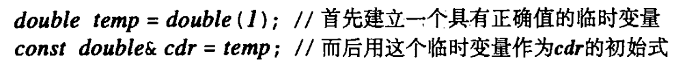

对变量的赋值经常会变成对临时值的赋值，对于常量引用不会出现这种问题。

1. 运算符概览 P136
2. new 

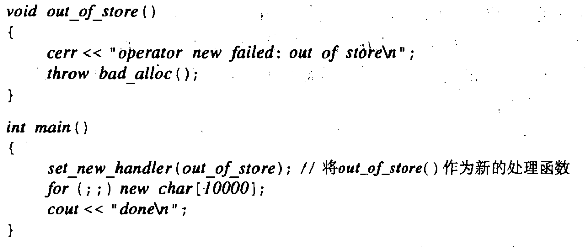

1. 使用（T）e显式转换类型是一件很危险的事情，最好使用*_cast

static_cast 相关类型转换

reinterpret_cast 不相关类型转换

dynamic_cast 运行中检查转换

const_cast 清除const, volatile限定符的转换

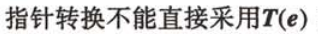

 typedef 会破坏这种保护

1. 函数指针

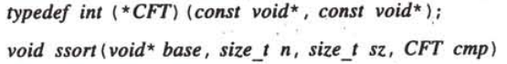

1. 头文件中不该有以下内容

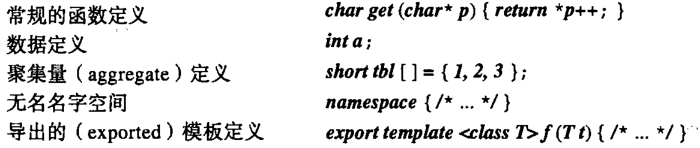

1. 与非C++代码连接

1. 全局变量初始化的顺序没有任何保证，在初始式之间建立任何顺序依赖都是不明智的。

可以利用函数返回强加顺序性。

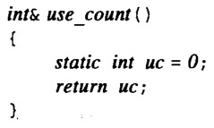

1. 程序结束的方式

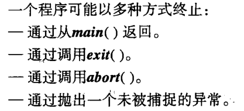

1. 唯一定义原则

------

第二部分 抽象机制

1. 常量成员函数

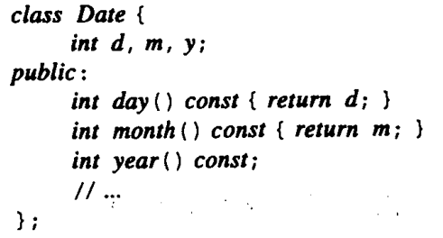

1. 自引用

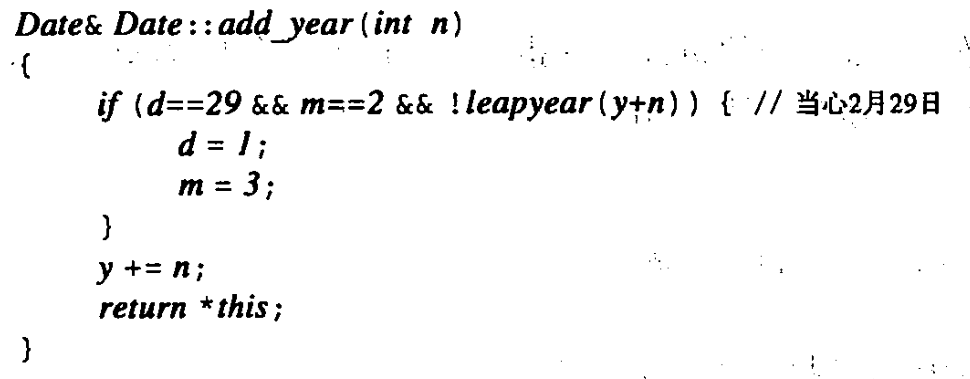

1. 缓存技术

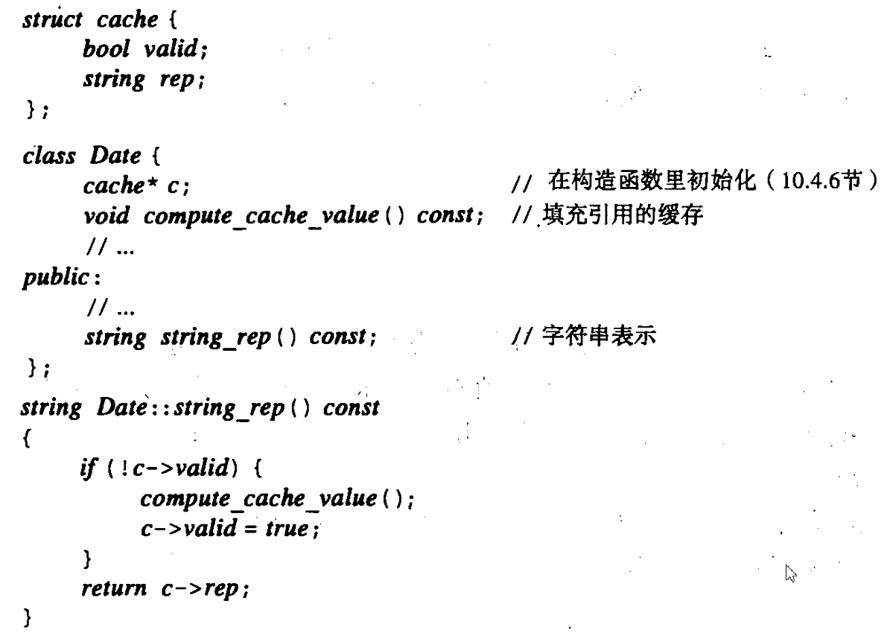

1. 对象的放置

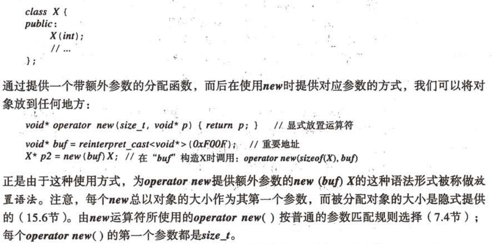

1. 运算符重载

1. 必须使用初始化列表进行初始化的：const对象、引用对象

1. 