# 中软实习

## JAVA

抽象
集合
异常
IO流
线程
GUI
网络
反射
设计模式
// 高级API

### 数据类型

#### 分类
          - 基本数据类型
               - 数值类型
                    -  整型     byte(1) short(2) int(4) long(8) char(2)
                    - 浮点型     float(4) double(8)
               - boolean类型     boolean(1bit)
               - Void
          - 引用数据类型
               - 类
               - 接口
               - 数组
               - null
     BigInteger BigDecimal 运算要用方法调用

#### 类型转换
自动: 小转大

```java
byte b = 2, e = 3;
byte f = (byte) (b + e);
System.out.println(f);
```


int--> float
long--> float
long--> double
float -->double without strictfp


强制


​          


### 面向对象

#### 类
     - 属性
     - 方法
     - 构造函数      默认protected
     - 块
     - 内部类
          作用:
          1.内部类可以很好的实现隐藏
                    一般的非内部类，是不允许有 private 与protected权限的，但内部类可以
          2.内部类拥有外围类的所有元素的访问权限
          3.可是实现多重继承
          4.可以避免修改接口而实现同一个类中两种同名方法的调用。
          外部访问: out.new Inner()
    
     this/super
          this: 本类
          super: 父类
          this是一个指向本对象的指针(句柄), 然而super是一个Java关键字.
    
     子类的构造过程中，必须调用其父类的构造方法
     如果子类的构造方法中没有显示的调用基类构造方法，则系统默认调用基类无参数的构造方法

#### 抽象类 接口
          ##### 抽象类
          有抽象方法一定是抽象类
          抽象类可以有成员属性和实现方法
          抽象类不能实例化
    
          ##### 接口
          抽象方法的集合
          只能有static final常量 (修饰符可以省略)
          只能有public的抽象方法 (默认public)
          面向接口编程是面向对象编程的一部分
    
          - 区别
              抽象类可以提供成员方法的实现细节, 而接口中只能存在public abstract 方法
        抽象类中的成员变量可以是各种类型的, 而接口中的成员变量只能是public static final类型的
               接口中不能含有静态代码块以及静态方法, 而抽象类可以有静态代码块和静态方法(java8可以)
               一个类只能继承一个抽象类, 而一个类却可以实现多个接口。

|          | abstract class | interface      |
| -------- | -------------- | -------------- |
| 属性     | 不用限制       | 静态常量       |
| 构造方法 | 可有可无       | 没有           |
| 普通方法 | 可以有具体方法 | 必须是抽象方法 |
| 子类     | 单一继承       | 多重实现       |


#### 修饰符

     - 访问修饰符
          public private protected friendly(default)
    
     - static final
          属性:     static 内存中只有一份拷贝, 实例共享     final 常量, 初始化赋值一次
          方法:     static 不依赖于实例 可直接通过类名调用     final 不可被重写
          类:      final 不可被继承

#### 转型
     向上转型     提高程序扩展性
     向下转型     使用子类方法
     - 父类引用指向子类对象
     - 子类引用不能指向父类对象
    
     如果一个对象的编译期类型是父类, 运行期类型是子类, 可以对该对象进行强制类型转换, 将其编译器类型转换为与运行期类型相同的类型, 但是只能调用动物类中定义的方法, 扩展的新方法不能调用
     调用有重载的非静态成员方法, 调用子类方法
     调用有重载的静态成员方法, 调用父类方法
     调用成员变量, 由于变量没有覆盖, 调用父类变量
    
     当方法的形式参数类型是父类类型, 传递的实际参数可以是任意子类的对象 减少代码量


#### 泛型
     泛型，即“参数化类型”。一提到参数，最熟悉的就是定义方法时有形参，然后调用此方法时传递实参。那么参数化类型怎么理解呢？顾名思义，就是将类型由原来的具体的类型参数化，类似于方法中的变量参数，此时类型也定义成参数形式（可以称之为类型形参），然后在使用/调用时传入具体的类型（类型实参）。


### 异常
- 异常分类
     - java.lang.throwable
          - java.lang.Error
          - java.lang.Exception

     - 运行期异常: 程序运行时抛出的异常, 所有RuntimeException的子类都是运行期异常
          - 数学异常
          - 空指针异常
          - 数组下标越界异常
         
   - 编译器异常: 除去运行期的异常都是编译期异常, 也称检测异常
          - IOException
          - SQLException


     catch: 分别捕获不同类型的异常，要从子类往父类的顺序写，否则有编译错误
    
     return 最后执行
    
     throws
     - 任何方法都可以使用throws关键字声明异常类型，包括抽象方法。
     - 子类覆盖父类中的方法，子类方法不能声明抛出比父类范围更大的异常。
     - 使用了throws的方法，调用时必须处理声明的异常，要么使用try-catch，要么继续使用throws声明
    
     自定义异常: 继承Exception 往往不写其他方法, 只重载需要使用的构造方法(super)

至少有两种情况下finally语句是不会被执行的：
（1）try语句没有被执行到，如在try语句之前就返回了，这样finally语句就不会执行，这也说明了finally语句被执行的必要而非充分条件是：相应的try语句一定被执行到。
（2）在try块中有System.exit(0);这样的语句，System.exit(0);是终止Java虚拟机JVM的，连JVM都停止了，所有都结束了，当然finally语句也不会被执行到。

finally块的语句在try或catch中的return语句执行之后返回之前执行且finally里的修改语句不能影响try或catch中 return已经确定的返回值，若finally里也有return语句则覆盖try或catch中的return语句直接返回。

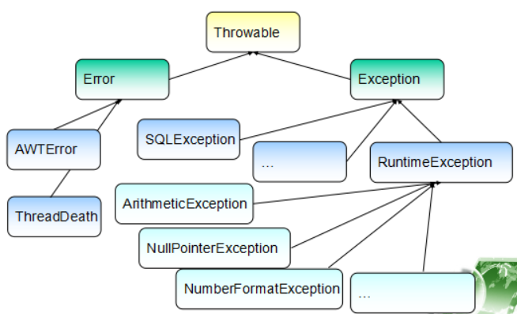


### 正则

Pattern.compile("a*b"); Matcher m = p.matcher("aaaaab"); boolean b = m.matches();
boolean b = Pattern.matches("a*b", "aaaaab");


### 文件 流

#### XML解析
          DOM(Document Object Model)
          DTD(Document Type Definition)
          SAX(Simple API for XML)
          XSD(Xml Schema Definition)
          XSLT(Extensible Stylesheet Language Transformations)


     深复制 先实现串行化Serializable
ByteArrayOutoutStream bo=new ByteArrayOutputStream();
ObjectOutputStream oo=new ObjectOutputStream(bo);
oo.writeObject(this);

ByteArrayInputStream bi=new ByteArrayInputStream(bo.toByteArray());
ObjectInputStream oi=new ObjectInputStream(bi);
return(oi.readObject());

Annotation
     内建:  @Override：覆写的Annotation
        @Deprecated：不赞成使用的Annotation
        @SuppressWarnings：压制安全警告的Annotation

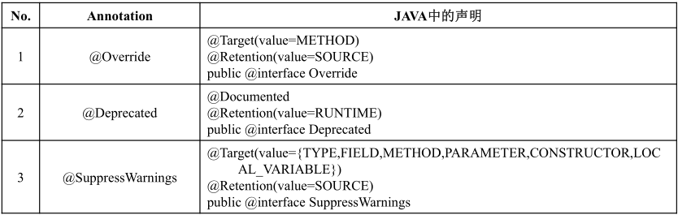

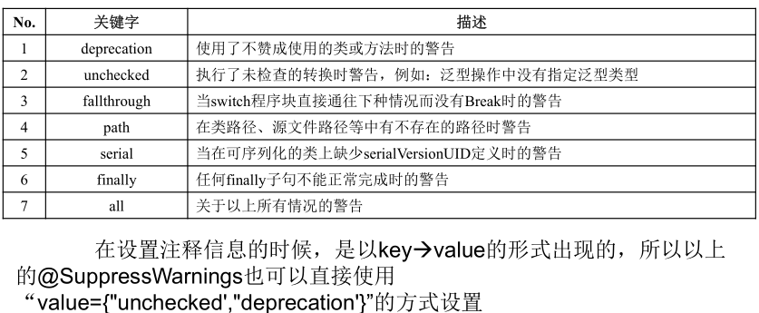

自定义:
 [public] @interface Annotation名称{
 数据类型 变量名称() default 默认值;
 }

@Rentetion
RententionPolicy     SOURCE CLASS RUNTIME

反射获得 Annotation

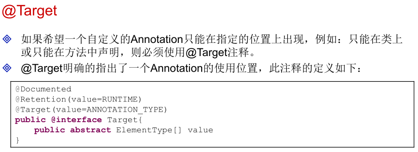


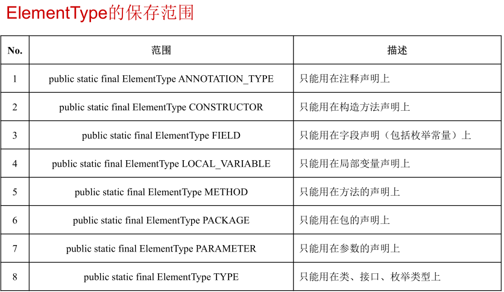


     @Documented
          @Documented[public] @interface Annotation名称{
          数据类型 变量名称() ;
          }
    
     @Inherited用于标注一个父类的注释是否可以被子类所继承，如果一个
     Annotation，需要被其子类所继承的话，则在声明的时候直接使用
     @Inherited注释即可。


### GUI

Swing
布局管理
FlowLayout
BorderLayout
GridLayout
CardLayout
AbsoluteLayout


## Oracle

### Oracle基础

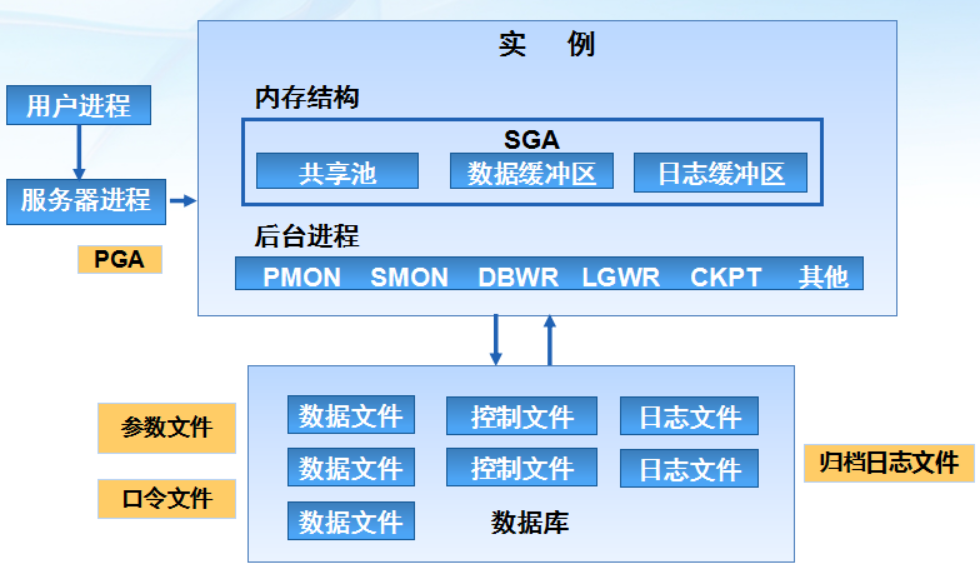

   模式为模式对象的集合 每一个用户对应一个模式 模式对象是用户拥有的对象 非模式对象与用户无关, 如表空间 .

   用于区分一个数据库的内部标识 ( 全局数据库名=数据库名+域名 )使数据库的取名在整个网络环境中唯一

   根据安装时创建数据库ORCL，使用Sytem用户登录前做哪些工作？ 启动数据库服务 配置客户端网络服务 每个数据库都有SYS和SYSTEM两个默认用户，都具有创建用户权限 使用SYSTEM用户登录ORCL数据库

   OracleService<SID>：数据库服务 OracleOraDb11g_hom1TNSListener ：数据库监听服务 OracleDBConsole<SID>：企业管理器服务

   Oracle中的 Net Manager工具和Net Configuration Assistant都能用来配置监听器和网络服务名

   SYS用户: Oracle的一个超级用户   主要用来维护系统信息和管理实例   只能以SYSDBA或SYSOPER角色登录

   SYSTEM用户: Oracle默认的系统管理员, 拥有DBA权限   通常用来管理Oracle数据库的用户, 权限和存储等   只能以Normal方式登录

   数据定义语言(DDL)   

​     CREATE

​     ALERT

​     DROP

​     TRUNCATE

   

   数据操纵语言(DML)

​     INSERT

​     UPDATE

​     DELETE

​     SELETE

   事务控制语言(TCL)

​     COMMIT

​     SAVEPOINT

​     ROLLBACK

   

   数据控制语言(DCL)

​     GRANT

​     REVOKE

   创建用户

   CREATE USER user

   IDENTIDIFIED BY password

   [DEFAULT TABLESPACE tablespace]

   [TEMPORARY TABLESPACE tablespace]

   角色是具有名称的一组权限的组合

   -- 分配权限或角色

​     GRANT privileges or role TO user;

   -- 撤销权限或角色

​     REVOKE privileges or role FROM user;

   数据类型

​     \- 字符   

​        CHAR:   存储固定长度的字符串

​        VARCHAR2:   存储可变长度的字符串

​        NCHAR和NVARCHAR2:   存储Unicode字符集类型

​     \- 数值

​        NUMBER:   存储整数和浮点数, 格式为NUMBER(p,s)

​     \- 日期时间

​        DATE:   存储日期和时间数据

​        TIMESTAMP:   秒值精确到小数点后6位

​     \- LOB

​        BLOB:   存储二进制对象

​        CLOB:   存储字符格式的大型对象

​        BFILE:   将二进制数据存储操作系统文件中

   经验: 不建议使用VARCHAR, INTEGER, FLOAT, DOUBLE等类型.

   主键约束: 要求主键列数据唯一, 并且不允许为空

   唯一约束: 要求该列唯一, 允许为空, 但只能出现一个空值

   检查约束: 某列取值范围限制, 格式限制等, 如有关年龄的约束

   外键约束: 用于两表间建立关系, 需要指定引用的主表的那列

   

   ALTER TABLE 表名

​     ADD CONSTRAINT 约束名 约束类型 具体的约束说明

​     

   ALTER TABLE 表名

​     DROP CONSTRAINT 约束名

\### 命令

   lsnrctl start/stop

   net start/stop oracleserviceorcl

   listener.ora

   tnsnames.ora HOST PORT

   

   \#### alter password

   sqlplus /nolog;

   conn /as SYSDBA;

   SELECT username FROM dba_users;

   ALTER user 用户名 IDENTIFILED BY 新密码;

   

   tab 所有表

   set pagesize 20;

   set linesize 100;

​     /: 上条指令

   

   emp... meaning

   alter user scott account unlock;

   alter user scott identified by tiger;

   

   主键约束 primary key

   唯一约束 

   检查约束 check

   外键约束 foreign key references

   not null

   备份表

   create table table_name_bak as select * from table_name;

   alter table_name_bak add constraint column_name the_constraint

   col name for a100

   ROWID

   ROWNUM

   CREATE USER user IDENTIFIED BY password

   [DEFAULT TABLESPACE tablespace]

   [TEMPORARY TABLESPACE tablespace]

   GRANT privileges or role TO user

   REVOKE privileges or role FROM user

   系统权限分类：

   DBA: 拥有全部特权，是系统最高权限，只有DBA才可以创建数据库结构。

   RESOURCE:拥有Resource权限的用户只可以创建实体，不可以创建数据库结构。

   CONNECT:拥有Connect权限的用户只可以登录Oracle，不可以创建实体，不可以创建数据库结构。

   CREATE TABLESPACE user1_tablespace

   DATAFILE 'E:\oracle\product\10.2.0\oradata\ORCL\user1.DBF'

   SIZE 100 M

   AUTOEXTEND ON NEXT 32M MAXSIZE UNLIMITED

   LOGGING

   EXTENT MANAGEMENT LOCAL

   SEGMENT SPACE MANAGEMENT AUTO;

   ALTER USER 用户名 DEFAULT TABLESPACE 表空间名字

   ALTER TABLE schema.AC01 MOVE TABLESPACE AA

------

   当前数据库的所有表空间及其对应的数据文件: dba_data_files

   临时表信息: dba_temp_files

   控制文件存放路径由服务器参数文件 SPFILEsid.ora的control_files参数决定

   所有控制文件损坏, 系统不能工作

   V$CONTROLFILE数据字典可查看控制文件信息

   

   日志文件: 重做日志文件, 归档日志文件

   V$LOGFILE 临时表空间信息

   V$DATABASE 是否为归档模式

   SPFILE的log_archive_dest确定归档日志文件路径

   SPFILE一般通过企业管理器或ALTER SYSTEM命令修改

   V$PARAMETER user_dump_dest 查询当前数据库实例用户跟踪文件路径

   SGA系统全局区 由三部分组成, 数据缓冲区, 日志缓冲区, 共享池

   

   查看oracle后台进程 select name, description from v$bgprocess

   程序全局区(PGA) 用户全局区(UGA) 调用全局区

   PGA为私有区 show parameter pga

   数据字典

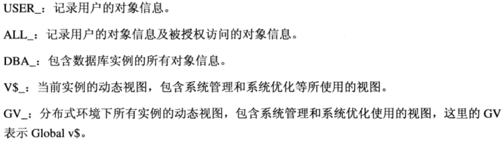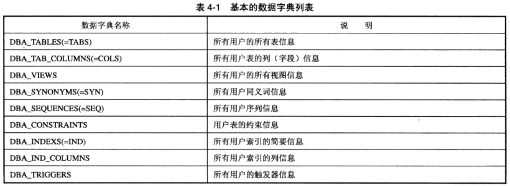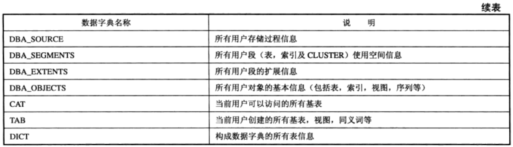

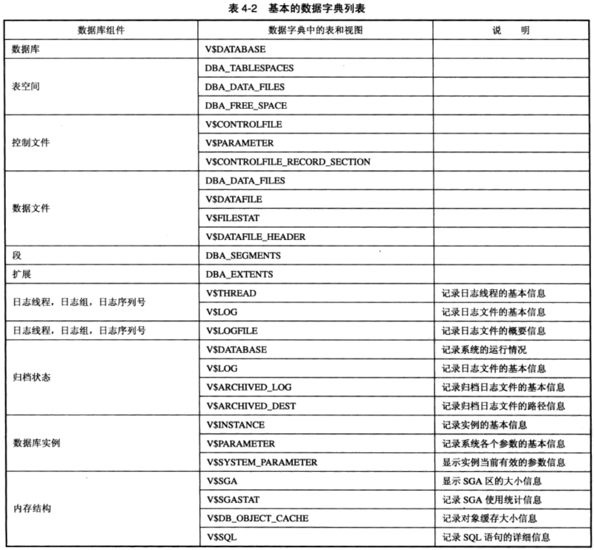

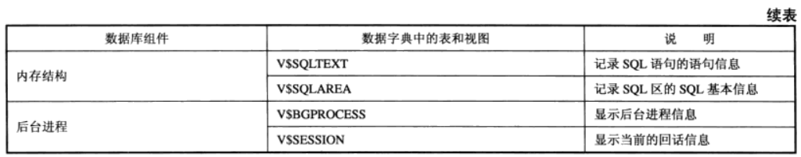

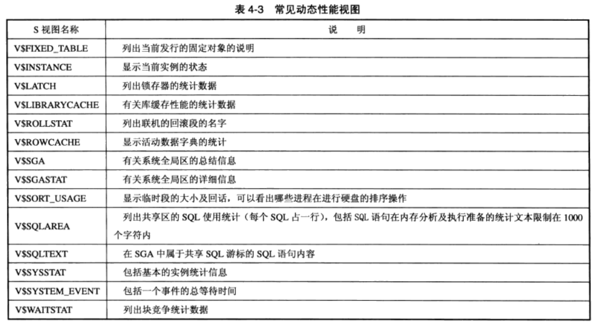

SELECT DML TCL DDL DCL

基本函数

   字符函数

   ASCII('A') 65

   CHR(65) 'A'

   CONCAT('asdf','qwer')

   INITCAP(str) 单词首字母大写

   INSTR(str1, str2, [, i[, j]]) INSTR('MISSISSIPPI', 'I', 3, 3) 11

   i, j 默认值为1, 返回str2在str1中第j次出现的位置

   INSTRB(str1, str2, [, i[, j]]) 返回字节, 单字节与INSTR效果相同

   LENGTH(str)

   LENGTHB(str)

   LOWER(c)

   LPAD(str1, i, str2) 用str2 补足str1 长度i c2默认单空格

   LTRIM(str1, str2) 去掉str1最左字符使第一个字符不在str2中

   LTRIM('Mississippi','Mis') ppi

   RPAD(str1, i, str2) 

   RTRIM(str1[, str2]) 

   REPLACE(str1, [str2, str3]) str3代替出现在str1中的str2后返回

   SUBSTR(str1, i, [, j]) 

   SUBSTRB(str1, i, [, j]) 

   SOUNDEX(str1) 发音相近

   TRANSLATE(c1, c2, c3) 将c1中与c2相同的字符以c3代替

   TRIM(c1 from c2) 头尾截断c1

   UPPER(str)

数字函数

   P106(P85)

日期函数

转换函数

组函数(集合函数)

   集合操作

   UNION | UNIONALL | INTERSECT

 | MINUS

   DECODE(c1,c2,c3,c4) c1==c2 return c3 else c4

CREATE UNIQUE INDEX index_name ON table_name(column, ...) TABLESPACE indx

CREATE [OR REPLACE] VIEW view_name AS SELECT ...

SYNONYM 同义词

MERGE INTO table_name1 USING table_name2 ON (condition) WHEN MATCHED THEN (UPDATE... INSERT...)

TRUNCATE table_name 删除所有行, 快速, 无日志记录

DESCRIBE table_name 

 