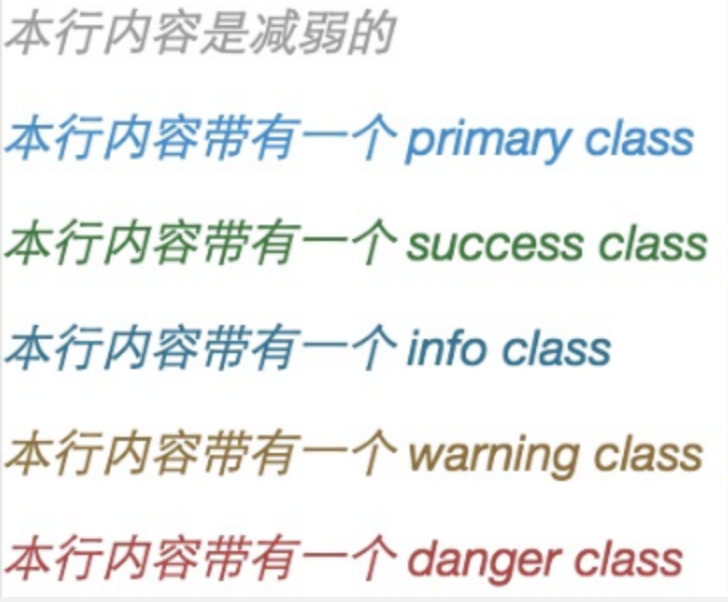
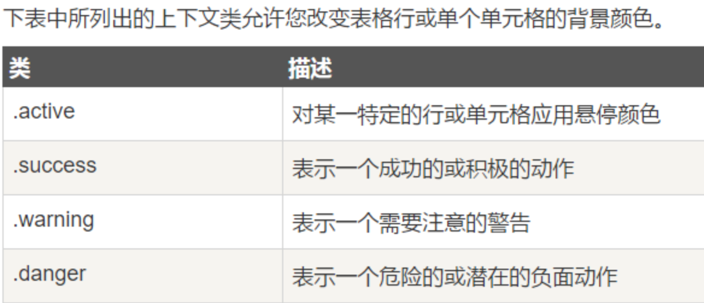

# Bootstrap

## Bootstrap 1-1 CSS

\### 网格系统

媒体查询

@media (min-width: @screen-md-min) and (max-width: @screen-md-max) { ... }

网格选项


偏移列

xs不支持，可以使用空的单元格

.col-md-offset-*

列排序

.col-md-push-* 和 .col-md-pull-*

\### 排版

标题子标题

`<small>` 字号更小，颜色更浅的标题（副标题）

强调

`<strong>`

`<em>`

.lead 更大更粗、行高更高的文本

.text-left 向左对齐文本

.text-center 居中对齐文本

.text-right 向右对齐文本

.text-muted 减弱

.text-primary 

.text-success 

.text-info 

.text-warning 

.text-danger 



缩写

`<abbr title="Source" [class="initialism"]>ABBR</abbr>`

initialism 更小的字体

地址

`<address>`

默认为 display:block，需手动换行

引用

`<blockquote>`   可以用small表示来源 可以用右对齐

`<cite title="show">content</cite>`

列表

ol

ul   .list-inline 内联列表 list-unstyled 未定义样式表

dl   .dl-horizontal 水平定义列表


\### 代码显示

`<code>`     内联显示代码

`<pre>`     显示为一个独立的块元素或者代码有多行

\### 表格

tr th td


table样式


tr th td上下文



响应式表格

适应小型设备 .table-responsive 


## Bootstrap 1-2 CSS

\### 表单

基本表单 垂直表单

```
<form role="form">
     <div class="form-group"></div>
 </form>
```


内联表单

如果需要创建一个表单，它的所有元素是内联的，向左对齐的，标签是并排的，请向 <form> 标签添加 class .form-inline。

水平表单

```
<form role="form-horizontal">

     <div class="form-group">

​     <input type="inputfile" class="form-control">
```


表单控件

input   text password datetime datetime-local date month time week number email url search tel color

textarea   @rows=3

checkbox   .checkbox-inline 内联

radio      .radiobox-inline 内联 

select    `<option>`   multiple[="multiple"] 


静态控件

```
label .control-lable

     <p> .form-control-static

```


高度和宽度

.input-lg .input-sm    高度 

.col-lg-*   宽度

帮助文本

.help-block 占用整个宽度的内容块

\### 按钮


```
<a btn [active] [disabled]>
```


建议在`<button>`上使用

### 图片

.img-rounded 添加 border-radius:6px 来获得图片圆角 

.img-circle 添加 border-radius:50% 来让整个图片变成圆形 

.img-thumbnail 添加一些内边距（padding）和一个灰色的边框 


### 辅助类

文本


背景


其他


### 响应式实用工具


## Bootstrap 2-1 布局组件

### 字体图标

Glyphicons

`<span class="glyphicon glyphicon-search"></span>`

\### 下拉菜单

.dropdown

   .data-toggle="dropdown"

   .dropdown-menu

.dropdown-header

上拉：父级元素加 .dropup

### 按钮组

.btn-group

.btn-toolbar

.btn-group-lg, .btn-group-sm, .btn-group-xs

.btn-group-vertical

### 输入组

```
.input-group

   <span>.input-addon

   .input-control
```

大小

.input-group-lg .input-group-sm .input-group-xs

单选 复选 按钮 下拉菜单 分割的下拉菜单作为前后缀

```
<span>

   <input>
```

\### 导航元素

表格导航

.nav .nav-tabs

ul li

胶囊式

.nav .nav-pills

垂直式

.nav .nav-stacked

两端对齐

.nav .nav-justified

禁用链接

li .disabled

下拉菜单

### 导航栏

.navbar .navbar-default

父元素添加role="navigation"， 增加可访问性

```
标题 .navbar-header   <a>.navbar-brand

<ul>.nav .navbar-nav
```

响应式导航栏

```
<button>.navbar-toggle @data-toggle="collapse" @data-target="#id"

<div>.collapse .navbar-collapse id
```

导航栏中的表单

```
.navbar-form

<form class="navbar-form navbar-left" role="search">
```

导航栏中的文本

.navbar-text

导航栏中的其他链接

.navbar-link

导航栏中的对齐方式

.navbar-left   .navbar-right

导航栏固定到顶部或底部

.navbar .navbar-fixed-top

.navbar .navbar-fixed-bottom

静态顶部

.navbar .navbar-static-top

色彩倒置

.navbar-inverse

\### 面包屑导航

.breadcrumb

.breadcrumb > li + li:before {

 color: #CCCCCC;

 content: "/ ";

 padding: 0 5px;}

\### 分页

.pagination   默认分页

.disabled .active    定义不可点链接，指示当前页面

.pagination-lg .pagination-sm   大小

翻页

.pager   默认翻页

.previous .next   左右对齐

.disabled   颜色变淡

\### 标签

.label-default

.label-primary

.label-success

.label-info

.label-warning

.label-danger

\### 徽章Badges

```
<span class="badge" />
```


\### 超大屏幕Jumbotron

.jumbotron

\### 页面标题Page Header

.page-header

`<div .><h1>`

\### 缩略图thumbnail

`<a>.thumbnail`

`<div .>` 可以自定义样式

\### 警告

.alert-success

.alert-info

.alert-warning

.alert-danger

可取消

.alert-dismissable

`<button> @data-dismiss="alert"`

警告中的链接

.alert-link

\### 进度条

```
.progress

     <div class="progress-bar" role="progressbar" aria-valuenow="60"

   aria-valuemin="0" aria-valuemax="100" style="width: 40%;">
```

状态

progress-bar-*

success info warning danger

条纹

.progress .progress-striped

动画

.active

堆叠

多个.progress-bar添加到一个.progress中实现堆叠

\### 多媒体对象   


```
<ul>.media-list

   <li>.media

          .meida-object

​      .media-body

​      .meida-heading
```

\### 列表组

ul .list-group

li .list-group-item

添加链接

div 代替 ul

\### 面板

.panel .panel-default

   panel-body

.panel-heading   简单地向面板添加标题容器

.panel-title   用<h1-6>添加预定义样式的标题

.panel-footer   面板脚注

带语境色彩的面板

panel-primary

panel-success

panel-info

panel-warning

panel-danger

表格

没有包含.panel-body 的<div>，则组件会无中断地从面板头部移动到表格

列表组

\### Well

.well        well

.well-lg .well-sm   改变大小


## Bootstrap 3-1 插件

\### 概览

$(document).off('.data-api')   关闭data属性API

$(document).off('.alert.data-api')   关系特定插件

data 属性    

编程方式的 API

事件

\### 过渡效果Transition

\### 模态框Modal

```
<button data-toggle data-target>

     <div class="modal fade" id role="dialog">

          <div .modal-dialog

               <div .modal-content

                    <div .modal-header

​             .close [data-dismiss="modal"]

​          .modal-title .modal-body .modal-footer
```

模态框选项


方法


事件


\### 下拉菜单

$('.dropdown-toggle').dropdown()   js调用

$().dropdown('toggle')   切换

\### 滚动监听Scrollspy

$('body').scrollspy({ target: '.navbar-example' })

更新DOM

$('[data-spy="scroll"]').each(function () {

 var $spy = $(this).scrollspy('refresh')})

事件

activate.bs.scrollspy

href #id

\### 标签页

data-toggle="tab" 或 data-toggle="pill"

<a>

\### 提示工具Tooltip

@data-toggle="tooltip" 

@data-placement="right"


方法事件

\### 弹出框Popover

data-toggle="popover"


\### 警告框

.alert .alert-*

data-dismiss="alert"   可关闭

\### 按钮

加载状态

data-loading-text="xxx"

单个切换

data-toggle="button"

复选框

data-toggle="buttons"

单选组

父级.btn-group 添加 data-toggle="buttons"

\### 折叠Collapse

```
<a data-toggle="collapse" data-parent="#accordion" href="#collapseOne">
```

折叠面板（accordion） + .data-parent

\### 轮播Carousel

\### 附加导航

导航栏 + @data-spy="affix"


## Tips

.sr-only 隐藏内联表单的标签

@title 鼠标提示

lable@for 与box的@id绑定 


