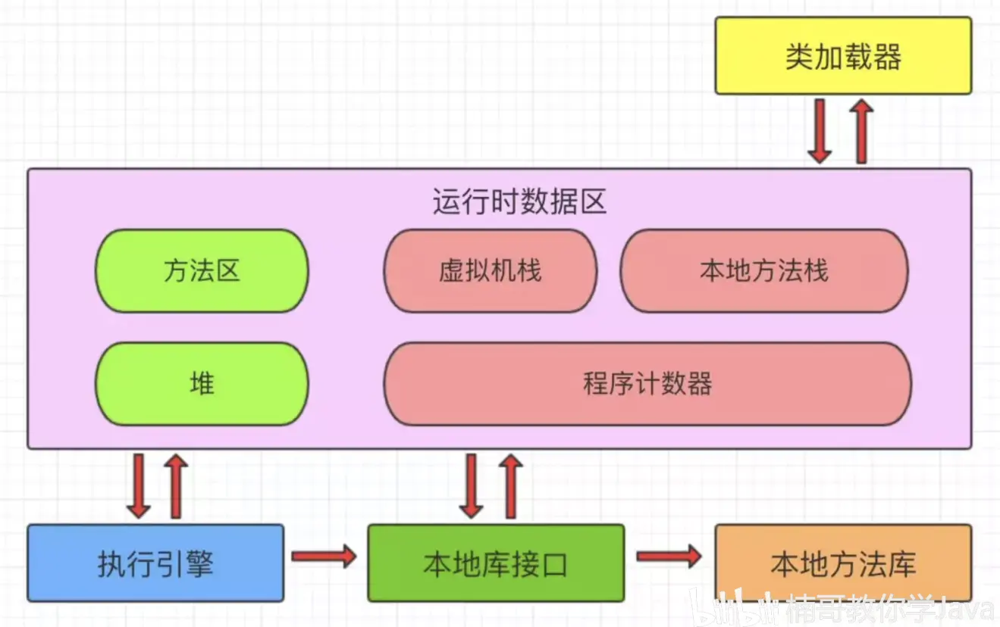
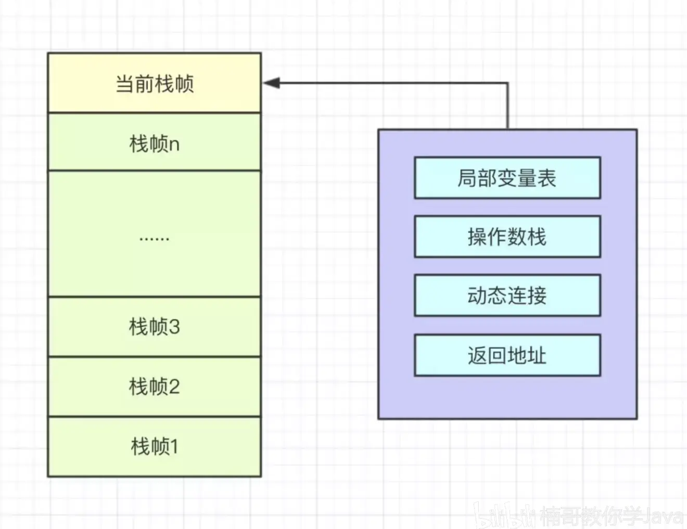
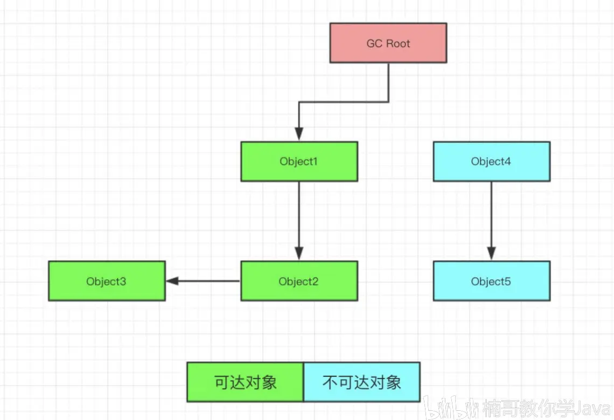
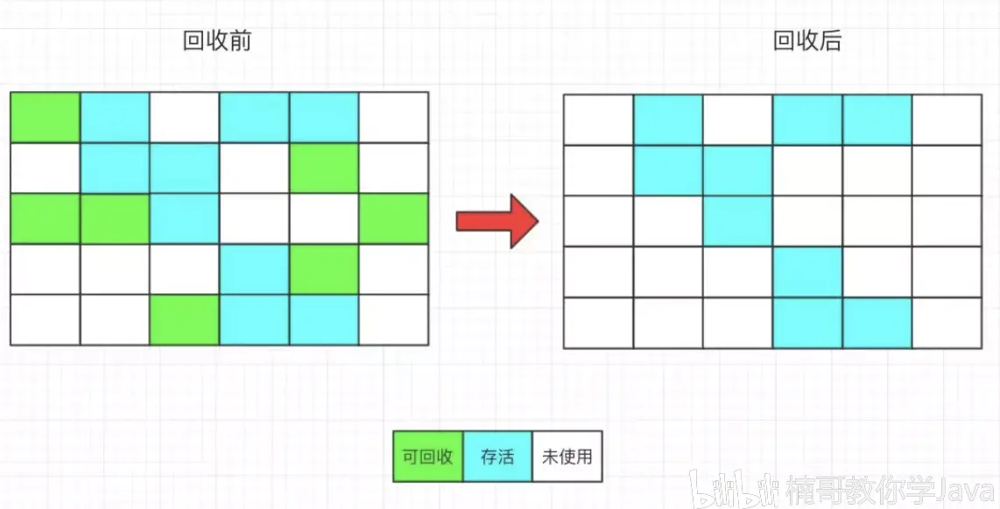
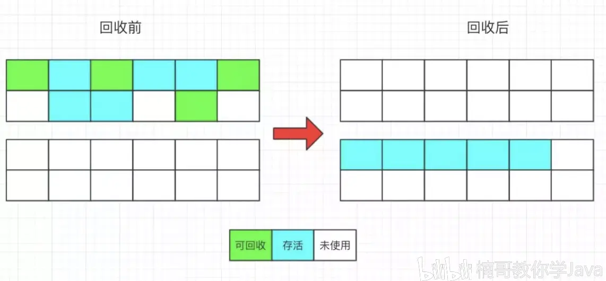
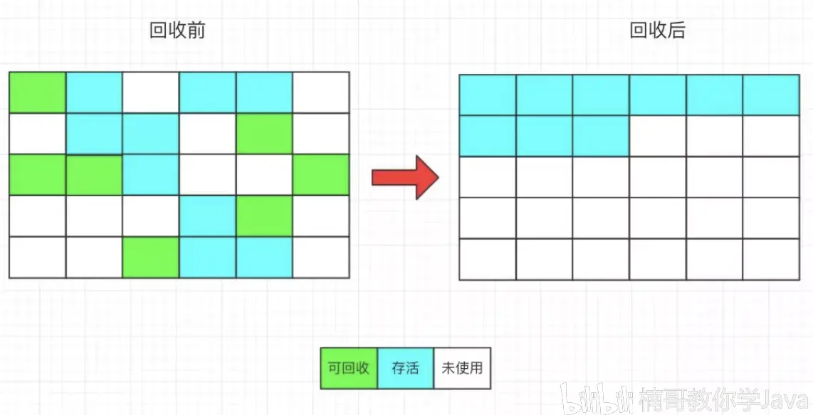

# Java


## Java8 特性

### lambda

Lambda 表达式主要用来定义行内执行的方法类型接口，例如，一个简单方法接口。在上面例子中，我们使用各种类型的Lambda表达式来定义MathOperation接口的方法。然后我们定义了sayMessage的执行。


lambda 表达式只能引用标记了 final 的外层局部变量，这就是说不能在 lambda 内部修改定义在域外的局部变量，否则会编译错误。


lambda 表达式的局部变量可以不用声明为 final，但是必须不可被后面的代码修改（即隐性的具有 final 的语义）


在 Lambda 表达式当中不允许声明一个与局部变量同名的参数或者局部变量。


### 方法引用

- **构造器引用：**它的语法是Class::new，或者更一般的Class< T >::new实例如下：
  final Car car = Car.create( Car::new );final List< Car > cars = Arrays.asList( car );
- **静态方法引用：**它的语法是Class::static_method，实例如下：
  cars.forEach( Car::collide );
- **特定类的任意对象的方法引用：**它的语法是Class::method实例如下：
  cars.forEach( Car::repair );
- **特定对象的方法引用****：**它的语法是instance::method实例如下：

final Car police = Car.create( Car::new );cars.forEach( police::follow );


### 函数式接口

lambda

@FunctionalInterface

interface GreetingService 

{

  void sayMessage(String message);

}


### 默认方法

```java
public interface Vehicle {
   default void print(){
      System.out.println("我是一辆车!");
   }
    // 静态方法
   static void blowHorn(){
      System.out.println("按喇叭!!!");
   }
}
```


### 流

```java
OptionalDouble avg = people.stream()
                .mapToInt(p -> p.getAge())
                .average();

avg.getAsDouble()
```


## ENV

JAVA_HOME=/Library/Java/JavaVirtualMachines/jdk1.8.0_152.jdk/Contents/Home

CLASSPAHT=.:$JAVA_HOME/lib/dt.jar:$JAVA_HOME/lib/tools.jar

export JAVA_HOME

export CLASSPATH

export PATH=$JAVA_HOME/bin:$PATH:


## JVM

JVM 一直都是面试的必考点，大家都知道，但是要把它搞清楚又好像不是特别容易。JVM 的知识点太散，不系统，所以不便于归纳总结，今天楠哥今天就来帮大家解决这个问题，用一篇文章把 JVM 的结构讲清楚。

JVM 可分为 5 个部分，分别是：

**1、类加载器（Class Loader）**

**2、运行时数据区（Runtime Data Area）**

**3、执行引擎（Execution Engine）**

**4、本地库接口（Native Interface）**

**5、本地方法库（Native Libraies）**

这其中最复杂的是运行时数据区，又可分为方法区、虚拟机栈、本地方法栈、堆、程序计数器，并且方法区和堆是线程共享的，虚拟机栈、本地方法栈、程序计数器是线程隔离的，JVM 的结构如下图所示。




搞清楚了 JVM 虚拟机的结构，接下来我们详细讲解它的每一部分。

**类加载器**：加载字节码文件到内存。

**执行引擎**：对 JVM 指令进行解析，翻译成机器码，解析完成后提交到操作系统中。

**本地库接口**：供 Java 调用的融合了不同开发语言的原生库。

**本地方法库**：Java 本地方法的具体实现。

**运行时数据区**：JVM 核心内存空间结构模型。

运行时数据区是 JVM 内存结构最重要的部分，接下来我们详细讲解运行时数据区的各个组成部分。

**1、方法区**

方法区存储虚拟机加载的类信息、常量、静态变量，即时编译器编译后的代码等数据。方法区是一种规范，永久代是方法区的一种实现，这里有个常考的面试题：JDK 7 以前的版本字符串常量池是放在永久代中的，JDK 7 将字符串常量池移动到了堆中，JDK 8 直接删除了永久代，改用元空间替代永久代。


**2、本地方法栈**

本地方法栈与 Java 栈的作用和原理基本相同，都可以用来执行方法，不同点在于 Java 栈执行的是 Java 方法，本地方法栈执行的是本地方法。

什么是 Java 的本地方法？Java 是基于应用层的高级编程语言，无法访问操作系统底层信息，如底层硬件设备等，这个时候就需要使用其他语言来完成功能了，比如 C 语言，本地方法的使用原理如下所示：

1、在 Java 程序中声明 native 修饰的方法，只有方法定义，没有方法实现，将该 Java 文件编译成字节码文件。

2、用 javah 编译字节码文件，生成一个 .h 文件。

3、写一个 .cpp 文件实现 .h 文件中的方法。

4、将 .cpp 文件编译成动态链接库文件 .dll 。

5、使用 System.loadLibrary() 加载动态连接库文件。

这样就可以实现本地方法的调用，用 Java 调用非 Java 编写的接口，基本原理是利用反射机制，在运行的时候找到 .dll 文件并且解析，根据动态链接库中的文件名称创建出对象和方法，然后我们就可以利用对象调用方法了。

常见的本地方法有：public final native Class<?> getClass()、public native int hashCode()、protected native Object clone()。


**3、程序计数器**

程序计数器占用的内存空间较小，是当前线程所执行的字节码行号指示器，通过改变这个计数器的值来选取下一条需要执行的字节码指令。多个线程之间的程序计数器相互独立，互不影响，为了保证每个线程都恢复后都可以找到具体的执行位置。


**4、Java 堆**

Java 堆用来存放实例化对象，Java 堆被所有线程共享，在虚拟机启动时创建，用来存放对象实例，是 Java 内存结构中的大头，占用大部分的空间，是 GC 的主要管理区域，又可分为年轻代、老年代、永久代，JDK 8 及以后去掉了永久代。

**年轻代**

年轻代又可分为 Eden，from Survivor，to Survivor。

Eden区：对象刚被创建的时候，存放在 Eden 区，如果 Eden 区放不下，则放在 Survivor 区，甚至老年代中。

Survivor 区：Survivor 又可分为 Survivor From 和 Survivor To，GC 回收时使用，将 Eden 中存活的对象存入 Survior From 中，下一次回收时，将 Survior From 中的对象存入 Survior To 中，清除 Survior From ，下一次回收时重复次步骤，Survior From 变成 Survior To，Survivor To 变成 Survivor From，依次循环，同时每次回收，对象的年龄都 +1，年龄增加到一定程度的对象，移动到老年代中。

**老年代**

存放生命周期较长的对象。JDK 8 之后改用元空间替代永久代。

**元空间**

Java 8 之后开始将类的元数据放在堆内存中，这块区域叫做元空间，在 Java 7 及以前，元空间是放在永久代中的，Java 8 之后分离出来了。

元空间和永久代是方法区的实现，方法区只是一种规范，在 Java 7 之后，原先位于方法区永久代里的字符串常量池已被移动到了 Java 堆中，因为永久代的内存空间极为有限，如果频繁调用 inter 方法，内存无法存储这么多数据。在 Java 8 之后将永久代完全删除了，使用元空间替代了永久代。

元空间使用本地内存，永久代使用 JVM 内存，所以使用元空间的好处在于程序的内存不在受限于 JVM 内存，本地内存剩余多少空间，元空间就可以有多大，解决了空间不足的问题。
**
**

**5、虚拟机栈**

Java 方法执行的内存模型，Java 栈中存放的是多个栈帧，每个栈帧对应一个被调用的方法，主要包括局部变量表、操作数栈、动态链接、方法返回地址（方法出口）。每一个方法的执行，JVM 都会创建一个栈帧，并且将栈帧压入 Java 栈，方法执行完毕，该栈帧出栈。




**局部变量表**：存储方法执行过程中的所有变量，包括方法中声明的局部变量和形参。

**操作数栈**：方法中的计算过程都是借助于操作数栈来完成的，将参与计算的数据压入操作数栈。

栈的具体运算方式是这样的，编译器是通过两个栈来实现的，一个是保存操作数的栈，另一个是保存运算符的栈。我们从左向右遍历表达式，当遇到数字，直接压入操作数栈。当遇到运算符，先与运算符栈的栈顶元素进行比较，如果高于当前栈顶元素的优先级，直接压入，否则取出当前栈顶的运算符，同时取出操作数栈的前两个数据进行运算，并将结果压入操作数栈。再次重复上述步骤，直到当前的运算符被压入栈中，当没有新的运算符需要入栈的时候，取出当前的栈顶元素以及操作数栈的两个运算，进行运算，将结果压入操作数栈，如果方法定义时需要返回值，直接将操作数栈栈顶元素返回即可。

**方法返回地址**：一个方法调用结束之后要返回到调用它的地方，所以栈帧中要保持能够返回到方法调用处的地址。

每个线程都有自己的 Java 栈，相互独立，可以同时执行各种的方法，每个方法的执行都是一个栈帧的入栈和出栈过程，Java 虚拟机栈用来存储栈帧，方法调用结束之后，帧会被销毁。


## GC

1. 简介

​     Java GC 对JVM (Java Virtual Machine) 中的内存进行标记, 确定哪些内存需要回收, 根据一定的回收策略, 自动回收内存, 永不停息 (Nerver Stop) 地保证JVM中的内存空间, 防止出现内存泄露和溢出问题。

 本文中默认介绍的虚拟机是HotSpot.

 Java GC机制主要完成3件事: 确定*哪些内存需要回收*, 确定*什么时候需要执行GC*, *如何执行GC*. 

​     我们将从4个方面学习Java GC机制: 1. 内存是如何分配的 2. 如何保证内存不被错误回收 (哪些内存需要回收) 3. 在什么情况下执行GC以及执行GC的方式 4. 如何监控和优化GC机制

1. Java内存区域

​     程序计数器 虚拟机栈 本地方法栈 堆区 方法区 直接内存

- 程序计数器 (Program Counter Register)

​     程序计数器是一个比较小的内存区域, 用于指示当前线程所执行的字节码执行到了第几行, 可以理解为是当前线程的行号指示器. 字节码解释器在工作时, 会通过改变这个计数器的值来取下一条语句指令.

 每个程序计数器只用来记录一个线程的行号, 所以它是线程私有 (一个线程有一个程序计数器) 的。

 如果程序执行的是一个Java方法, 则计数器记录的是正在执行的虚拟机字节码指令地址. 如果正在执行的是一个本地方法 (native 由C语言编写) , 则计数器的值为Undefined, 由于程序计数器只是记录当前指令地址, 所以不存在内存溢出的情况, 因此, 程序计数器也是所有JVM内存区域中唯一一个没有定义OutOfMemoryError的区域. 

- 虚拟机栈 (JVM Stack)

​     一个线程的每个方法在执行的同时, 都会创建一个栈帧 (Statck Frame), 栈帧中存储的有局部变量表, 操作栈, 动态链接, 方法出口等. 当方法被调用时, 栈帧在JVM栈中入栈, 当方法执行完成时, 栈帧出栈.

 局部变量表中存储着方法的相关局部变量, 包括各种基本数据类型, 对象的引用, 返回地址等. 在局部变量表中, 只有long和double类型会占用2个局部变量空间 (slot 对于32位机器, 一个slot就是32个bit), 其它都是1个slot. 需要注意的是, 局部变量表是在编译时就已经确定好的, 方法运行所需要分配的空间在栈帧中是完全确定的, 在方法的生命周期内都不会改变.

 虚拟机栈中定义了两种异常, 如果线程调用的栈深度大于虚拟机允许的最大深度, 则抛出StatckOverFlowError (栈溢出), 不过多数Java虚拟机都允许动态扩展虚拟机栈的大小 (有少部分是固定长度的), 所以线程可以一直申请栈, 知道内存不足, 此时, 会抛出 OutOfMemoryError (内存溢出). 

​      每个线程对应着一个虚拟机栈, 因此虚拟机栈也是线程私有的.

- 本地方法栈 (Native Method Stack)

​     本地方法栈在作用, 运行机制, 异常类型等方面都与虚拟机栈相同, 唯一的区别是: 虚拟机栈是执行Java方法的, 而本地方法栈是用来执行native方法的, 在很多虚拟机中 (如HotSpot), 会将本地方法栈与虚拟机栈放在一起使用. 

​      本地方法栈也是线程私有的.

- 堆区 (Heap)

​     堆区是理解Java GC机制最重要的区域, 没有之一. 在JVM所管理的内存中, 堆区是最大的一块, 也是Java GC机制所管理的主要内存区域. 堆区由所有线程共享, 在虚拟机启动时创建. 堆区的存在是为了存储对象实例, 原则上讲, 所有的对象都在堆区上分配内存 (不过现代技术里, 也不是这么绝对的, 也有栈上直接分配的). 

　　一般的, 根据Java虚拟机规范规定, 堆内存需要在逻辑上是连续的 (在物理上不需要), 在实现时, 可以是固定大小的, 也可以是可扩展的, 目前主流的虚拟机都是可扩展的. 如果在执行垃圾回收之后, 仍没有足够的内存分配, 也不能再扩展, 将会抛出OutOfMemoryError:Java heap space异常. 

- 方法区 (Method Area)

​     在Java虚拟机规范中, 将方法区作为堆的一个逻辑部分来对待, 但实际上, 方法区并不是堆 (Non-Heap). 另外, 不少人的博客中, 将Java GC的分代收集机制分为3个代: 青年代, 老年代, 永久代, 这些作者将方法区定义为”永久代", 这是因为在HotSpot的实现方式中, 将分代收集的思想扩展到了方法区, 并将方法区设计成了永久代. 不过, 除HotSpot之外的多数虚拟机, 并不将方法区当做永久代, HotSpot本身, 也计划取消永久代. 本文使用JDK6, 将使用永久代一词.

　　方法区是各个线程共享的区域, 用于存储已经被虚拟机加载的类信息 (加载类时需要加载的信息, 包括版本, field, 方法, 接口等信息), final常量, 静态变量, 编译器即时编译的代码等.

　　方法区在物理上也不需要是连续的, 可以选择固定大小或可扩展大小, 并且方法区比堆还多了一个选项: 可以选择是否执行垃圾收集. 一般的, 方法区上执行的垃圾收集是很少的, 这也是方法区被称为永久代的原因之一, 但这也不代表着在方法区上完全没有垃圾收集, 其上的垃圾收集主要是针对常量池的内存回收和对已加载类的卸载.

　　在方法区上进行垃圾收集, 条件苛刻而且相当困难, 效果也不令人满意, 所以一般不做太多考虑, 可以留作以后进一步深入研究时使用. 

　　在方法区上定义了OutOfMemoryError:PermGen space异常, 在内存不足时抛出。

​     运行时常量池 (Runtime Constant Pool) 是方法区的一部分, 用于存储编译期就生成的字面常量, 符号引用, 翻译出来的直接引用 (符号引用是用字符串表示某个变量, 接口的位置, 直接引用是根据符号引用翻译出来的地址, 将在类链接阶段完成翻译). 运行时常量池除了存储编译期常量外, 也可以存储在运行时间产生的常量 (如String类的intern()方法, String维护了一个常量池, 如果调用的字符“abc”已经在常量池中, 则返回池中的字符串地址. 否则, 新建一个常量加入池中, 并返回地址).

- 直接内存 (Direct Memory)

​     直接内存不是JVM管理的内存, 它是JVM以外的机器内存, 比如, 你有4G的内存, JVM占用了1G, 则其余的3G就是直接内存. JDK中有一种基于通道 (Channel) 和缓冲区 (Buffer) 的内存分配方式, 将由C语言实现的native函数库分配在直接内存中, 用存储在JVM堆中的DirectByteBuffer来引用.  由于直接内存收到本机器内存的限制, 所以也可能出现OutOfMemoryError的异常.

1. Java对象的访问方式

​     


垃圾收集 GC（Garbage Collection）是 Java 非常重要的核心技术之一，Java 开发中程序员不需要关心对象的内存分配和资源释放，这些都由 GC 来完成，这使得 Java 开发者只需要将注意力集中在业务逻辑的处理上。


学习 GC 需要从以下 4 个方面入手：

1、如何判断某个对象是垃圾，需要被回收？

2、垃圾回收算法。

3、不同内存区域的回收方式。

4、垃圾收集器的分类。


**如何判断对象是垃圾**

Java 对象被判定为垃圾的标准：没有被其他对象引用，判断方法有两种：

**1、引用计数算法**

通过判断对象的引用数量来决定是否要被回收，每一个对象实例都有一个计数器，被引用则+1，完成引用则-1。

什么是完成引用？

当该对象的引用超过了生命周期，或者引用指向了其他对象，在某方法中定义一个对象的引用变量，方法结束之后变量被虚拟机栈自动释放，则改对象的引用也就结束了，所以任何一个引用计数为 0 的对象是可以被当作垃圾回收的。

**2、可达性分析算法**

通过判断对象的引用链是否可达来决定对象是否要被回收，这个算法的基本思想就是通过一系列的称为 GC Root 的对象作为起点，从这些节点开始向下搜索，节点所走过的路径称为引用链，当一个对象到 GC Root 没有任何引用链相连的话，则证明此对象是不可达的，即认为它不可用，如下图所示。



什么对象可以作为 GC Root ？

1、虚拟机栈中的引用对象

2、方法区中的常量引用对象

3、方法区中的类静态属性引用对象

4、本地方法栈中的引用对象

5、活跃线程中的引用对象**
****
**

**垃圾回收算法**

1、标记-清除算法（Mark and Sweep）

**标记**：从根集合进行扫描，对存活的对象进行标记。

**清除**：对堆内存进行遍历，回收不可达对象内存。

**缺点**：清除后会产生大量不连续的内存碎片，可能导致后续在创建较大对象是无法找到足够的连续内存而触发再一次的垃圾回收，如下图所示。



2、复制算法

将可用内存分为对象面和空闲面，在对象面上创建对象，当对象面没有空间的时候，将还存活的对象复制到空闲面，将对象面所有对象清除。

解决了碎片化问题，顺序分配内存，简单高效，适用于对象存活率较低的场景，因为复制的内容少，所以效率高，如下图所示。



3、标记-整理算法

**标记**：从根集合进行扫描，对存活的对象进行标记。

**清除**：移动所有存活的对象，按内存地址依次排列，然后将末端地址以后的内存全部回收。

在标记-清除的基础上完成了移动，解决了内存碎片的问题，但是成本更高，适用于对象存活率较高的场景，如下图所示。



4、分代收集算法是一种组合的回收机制，也是 GC 的主流回收算法，将不同生命周期的对象分配到堆中的不同区域，采用不同的垃圾回收算法，提高 JVM 垃圾回收效率。

**不同内存区域的回收方式**

**年轻代**

使用 Minor GC 进行回收，采用复制算法，年轻代分为 Eden 区和 Survivor 区。

Eden区：对象刚被创建的时候，存放在 Eden 区，如果 Eden 区放不下，则放在 Survivor 区，甚至老年代中。

Survivor 区：Minor 回收时使用，将 Eden 中存活的对象存入 Survior 中（From），再一次 Minor 时，将 Survior From 中的对象存入 Survior To 中，清除 Survior From ，下一次 Minor 时重复次步骤，Survior From 变成 Survior To，Survior To 变成 Survior From，依次循环，同时每次 Minor，对象的年龄都 +1，年龄增加到一定程度的对象，移动到老年代中。

**老年代**

存放生命周期较长的对象，使用标记-清理算法或者标记-整理算法进行回收。
**
**

**垃圾收集器的分类**

**年轻代常见的垃圾收集器**

1、Serial 收集器（复制算法）：单线程收集，进行垃圾收集时，必须暂停所有工作线程。

2、ParNew 收集器（复制算法）：多线程收集，垃圾收集和工作线程可同时执行。

3、Parallel Scavenge 收集器（复制算法）：多线程收集，更关注系统的吞吐量。

Serial 收集器和 ParNew 收集器更关注用户线程停顿时间，停顿时间越短，响应速度越快，用户体验越好，适用于直接与用户交互的程序。

Parallel Scavenge 收集器更关注系统的吞吐量，可提升 CPU 的效率，尽快完成运算任务，适合在后台运行，不需要太多交互的程序。

**老年代常见的垃圾收集器**

1、Serial Old 收集器（标记-整理算法）：单线程收集，进行垃圾收集时，必须暂停所有工作线程。

2、ParNew Old 收集器（标记-整理算法）：多线程收集，垃圾收集和工作线程可同时执行，吞吐量优先。

3、CMS 收集器（标记-清除算法）：垃圾回收线程和用户线程几乎可以同时工作。

4、Garbage First 收集器（复制+标记-整理算法）：并发和并行，使用多个 CPU 来缩短 Stop-the-World 的停顿时间，与用户线程并发执行，并且可采用不同的方式去处理新产生的对象。同时有利于空间整合，基于标记-整理算法，可以解决内存碎片的问题。

任何一种 GC 算法中都会发生，当 Stop-the-World 发生时，除了 GC 的线程以外， 所有线程都处于等待状态，直到 GC 任务完成，多数 GC 优化就是通过减少 Stop-the-World 发生的时间来提高程序性能。


## 面试题

Java基础

- HashMap 的数据结构是什么
- HashSet 是如何保证不重复的
- HashMap 是线程安全的吗, 为什么不是线程安全的 (最好画图说明多线程环境下不安全) 
- HashMap 的扩容过程 
- HashMap 1.7 与 1.8 的区别, 说明 1.8 做了哪些优化, 如何优化的
- final finally finalize 
- 强引用 、软引用、 弱引用、虚引用
- Java 反射的实现原理
- Arrays.sort 实现原理和 Collection 实现原理
- LinkedHashMap 的应用 
- cloneable 接口实现原理
- 异常分类以及处理机制 
- 数组在内存中如何分配
- io 的模型和 nio selectionkey 是什么

线程池

- 解释线程池的作用
- 线程池的处理流程
- jdk 提供的线程池工具类有哪些, 区别是什么
- 关闭线程池的方法有哪些, 区别是什么

MySqL

- sql优化方法
- 建索引有哪些策略和原则
- 索引存储原理
- mysql数据库锁有哪几种
- 写一个数据库死锁的sql
- 如何做数据库分库分表 (mycat) 

消息队列

- RabbitMQ的exchange有哪几种
- mq的使用场景有哪些
- RabbitMQ的系统架构
- RabbitMQ的任务分发机制有哪些

Redis

- 使用redis有哪些好处
- redis相比memcached有哪些优势
- redis常见性能问题和解决方案
- redis集群有哪些模式
- redis中穿透, 击穿与雪崩的预防及解决
- redis哨兵模式集群的原理

Spring

- IOC和AOP的实现原理
- AOP的应用场景有哪些, 以及动态代理原理是什么
- 事务的传播属性有哪几种
- bean的生命周期
- Spring有哪些模块, 分别有哪些作用和功能

SpringMVC

- SpringMVC的工作原理, 举例说明流程

MyBatis

- Mybatis的二级缓存

Zookeeper

- zk的作用和原理
- zk设计要满足哪些特性, 分别解释一下
- zk的选举机制是什么, 是否有了解Paxos算法

Nginx

- 什么是Nginx, Nginx的作用是什么
- Nginx 有哪些特点

分布式

- 什么是分布式系统, 解决什么问题
- 如何提升系统吞吐量
- 如何降低延迟
- 如何做故障恢复
- 如何做日志统一系统
- 怎么实现通讯编程, 如rpc服务, webService服务等
- 高并发秒杀解决方案有哪些
- 分布式系统有哪些优势
- 分布式系统会面临什么挑战
- 如何设计分布式系统
- 如何做分布式事务

其他问题

- 如何将一个请求由原来的10s减少到3s, 可以从哪些地方优化
- 如何支持大量流量的访问, 可以在哪些地方进行优化
- 双11流量怎么控制
- 1亿无序的数据文件, 如何找出最小的10个数并去重 (topk算法
- 分布式环境下, 如何对一个web请求的做监控

HR问题

- 请说一下你为什么想跳槽, 为什么选择我们
- 你最近在关注那些领域的知识
- 你的职业规划是什么, 你对自己未来的定位是怎样的
- 最近是否有打算深造提升自己, 你平时是如何自学的, 你喜欢读书吗，都有那些书
- 你除了工作之外还有哪些兴趣爱好
- 工作中遇到挑战你通常是怎么处理的, 工作时是否遇到沟通中发生争执
- 你如何看待加班这件事
- 你觉得自己有哪些优势, 生活中别人是如何评价你的, 自己有哪些优点和缺点
- 你的期望薪资是多少, 最低能接受多少