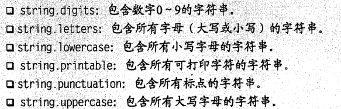

# Python

## Python 1-1

   - 普通整数不能大于2 147 483 647（不能小于-2 147 483 648）

   - Python范围（start，end） 包含start 不包含end

   - Python中赋值和比较可以连接（连在一起使用）

   - xrange计算元素一个一个来，不是计算所有元素

   - callable -> hasattr

   - help()

   - 支持函数嵌套

- 函数
   -- pow乘方 abs绝对值  len长度
   -- from math import sqrt
   -- cmath 虚数
   -- #注释
   
- 字符串
   -- 字符串是不可变的
   -- str：   把值转换为合理形式的字符串，以便用户理解
   -- repr：   创建一个字符串，以合法的Python表达式的形式来表示
   -- 长字符串： '''XXX'''
   -- u：Unicode
   -- r：Row
   
- 序列
   -- 列表[] 元组() 字符串 Unicode字符串 buffer对象 xrange对象
-- 通用序列操作：
   --- 索引
   --- 分片   [包含：不包含]  两个均可不填 （-1：最后一位）
   --- 步长    [包含：不包含：步长] 步长为负数时，从右到左提取元素，此时要注意开始结束的位置
   --- 序列相加
   --- 乘法     （None 初始化空列表）
   --- 成员资格   in
   --- 长度 大小 最大值   len min max
-- 列表函数
   --- list()   
   --- 基本列表操作：
     ---- 元素赋值   x[1] = 1   x=[1,2,3]
     ---- 删除元素   del
     ---- 分片赋值   
     ---- 列表方法   append   count   extend   index   insert   pop   remove   reverse   sort   sorted   cmp(cmpare)
-- 元组
   --- tuple   序列 -> 元组   
   --- 基本元组操作：同序列
   
- 使用字符串
   -- 基本操作
   -- 格式化   format % values   
    模板字符串: from string import
          s = Template("A action.")
          d = {}
          d['thing'] = 'gentleman'
          d['action'] = 'show his socks'
          s.substitute(d)

     0 '' - +的作用
  
   -- 字符串方法

     --- find   str.find("sub")   sub首地址   可提供起始点或结束点 or both   str.find("sub",st,ed")
     --- join   split逆方法
     --- lower   返回字符串的小写字母版   
        string.capwords
islower, capitalize, swapcase, title, istitle, upper, isupper
     --- replace expandtabs
     --- split rsplit splitlines
     --- strip lstrip rstrip
     --- translate maketrans   
           table = maketrans('source','dest')
          str.translate(table[,strToDel])
        可用于解决非英语字符串大小写问题
   
- 字典（映射）
   -- 使用与创建
     键唯一 值不唯一
     字典是无序的
     --- dict函数 通过其他映射或序列建立字典
       dict([('name','Gumby'),('age',42)])
       dict(name='Gumby',age=42)
     --- 基本字典操作
        \1. 键可以是任何不可变类型
        \2. 添加数据到空list要初始化，字典不需要
        ---- 字典格式化字符串

        ---- 字典方法
          1 clear 原地操作
          2 copy (shallow copy)
           copy.deepcopy
          3 fromkeys 初始化键，建立字典，可以自己提供默认值
           fromkeys(['name','age'],'a')
          4 get 访问字典项，不存在不会出错
             此方法可以方便对未知错误做处理
          5 items 以列表方式返回迭代器对象，返回值对
          6 keys 同items，返回键
          7 pop 通过键值移除键-值对，返回值
          8 popitem pop某个item，不定
          9 setdefault 类似get，还可以在字典中不含给定键的情况下设置相应的值，不设置默认使用None。
          10 update 用一个字典更新另一个字典，相同覆盖
          11 values 同items
   
- 逻辑语句
   -- if
    if bool:
       xxx
    elif bool:
       xxx
    else:
       xxx
    返回bool：is in
    bool运算符：and or not
   
   -- assert
   -- 循环
     --- while
     --- for range
   -- 迭代工具
     --- 并行迭代 zip
       zip可以作用于不等长的序列，最短的结束时就停止
     --- 编号迭代 enumerate

   ```
   for index, string in enumerate(alpha):
     print(index, ":", string)
   ```
   
   

   --- 翻转和排序迭代 reversed sorted 非原地修改
   -- 跳出循环
     1 break(python里很普遍)
     2 continue
     3 while True/break
   -- 列表推导式 轻量级循环
   
   -- pass del exec
     pass:跳过
     del:引用和list都删除
     exec:执行字符串中的py语句 <scope>放置字符串命名空间的字典
      exec 'sqrt = 1' in scope scope['sqrt']
     eval:计算py表达式，返回结果值 第二个参数可以是命名空间
   
- 抽象
   - 函数 def function(arg1[,arg2...])
     -- 记录函数 doc 函数属性
     -- 关键字参数 (xxx=xxx)
        可以用来给参数提供默认值
        混合使用时，将位置参数放在前面
     -- 收集参数 * 收集为元组，**可用于关键字参数，收集为字典
     
     -- 访问全局变量 最好用globals()['xxx']
     -- 重绑定全局变量 global
   


TIPS
- 清屏
   import os
   i=os.system('cls')


2.7.x 3.x区别

- [使用__future__模块](http://www.jb51.net/article/57956.htm#future)
- [print函数](http://www.jb51.net/article/57956.htm#print)
- [整数除法](http://www.jb51.net/article/57956.htm#division)
- [Unicode](http://www.jb51.net/article/57956.htm#unicode)
- [xrange](http://www.jb51.net/article/57956.htm#xrange)
- [触发异常](http://www.jb51.net/article/57956.htm#raise)
- [处理异常](http://www.jb51.net/article/57956.htm#handle)
- [next()函数和.next()方法](http://www.jb51.net/article/57956.htm#next)
- [For循环变量与全局命名空间泄漏](http://www.jb51.net/article/57956.htm#for)
- [比较无序类型](http://www.jb51.net/article/57956.htm#compare)
- [使用input()解析输入内容](http://www.jb51.net/article/57956.htm#input)
- [返回可迭代对象，而不是列表](http://www.jb51.net/article/57956.htm#iterable)
- [更多关于Python 2和Python 3的文章](http://www.jb51.net/article/57956.htm#more)