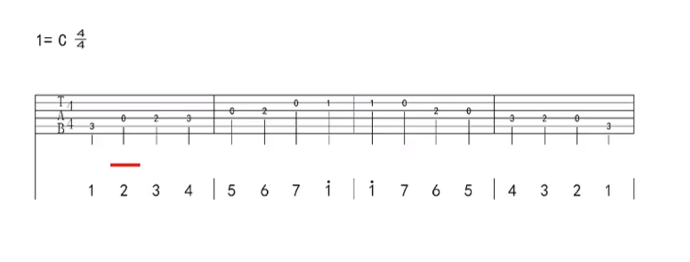
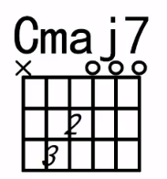
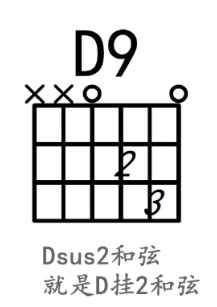
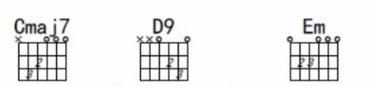

# Guitar

## 调音

|  1   |  2   |  3   |  4   |  5   |  6   |
| :--: | :--: | :--: | :--: | :--: | :--: |
|  E   |  A   |  D   |  G   |  B   |  E   |

|  C   |  D   |  E   |  F   |  G   |  A   |  B   |
| :--: | :--: | :--: | :--: | :--: | :--: | :--: |
|  do  |  re  |  mi  |  fa  | sol  |  la  |  si  |

## 音阶

## 上课笔记

C大7和弦

