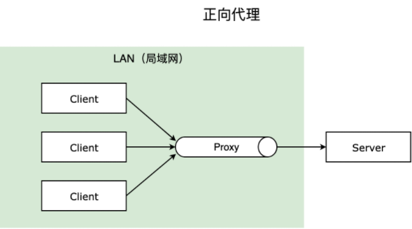
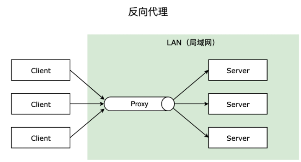
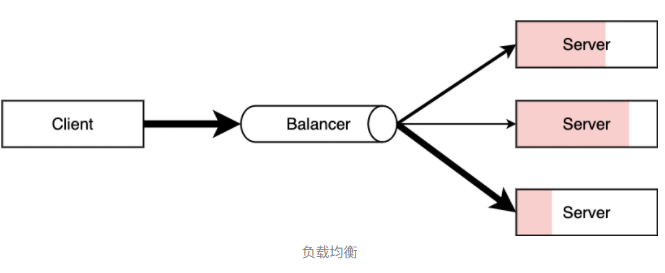
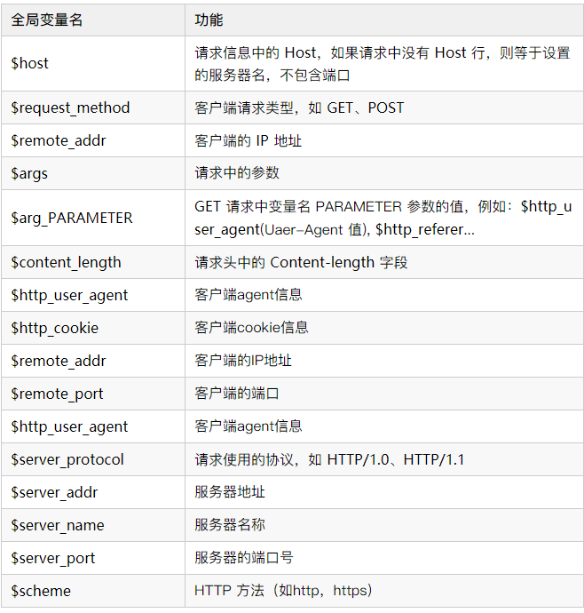
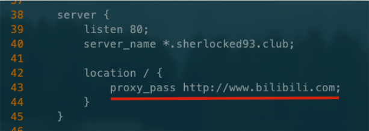
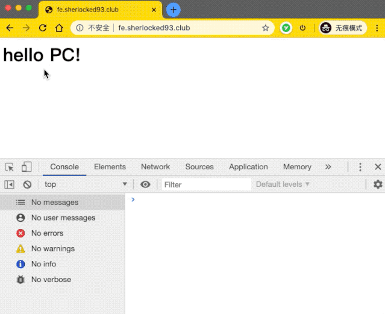

# Nginx

## 介绍

Nginx 是开源、高性能、高可靠的 Web 和反向代理服务器，而且支持热部署，几乎可以做到 7 * 24 小时不间断运行，即使运行几个月也不需要重新启动，还能在不间断服务的情况下对软件版本进行热更新。性能是 Nginx 最重要的考量，其占用内存少、并发能力强、能支持高达 5w 个并发连接数，最重要的是，Nginx 是免费的并可以商业化，配置使用也比较简单。

Nginx 擅长于底层服务器端资源的处理（静态资源处理转发、反向代理，负载均衡等），Node.js 更擅长上层具体业务逻辑的处理，两者可以完美组合，共同助力前端开发。


### 使用场景

1. 静态资源服务，通过本地文件系统提供服务；
2. 反向代理服务，延伸出包括缓存、负载均衡等；
3. API 服务，OpenResty ；


### 相关概念

#### 简单请求和非简单请求

简单请求（同时满足）：

1. 请求方法是 `HEAD`、`GET`、`POST` 三种之一；
2. HTTP 头信息不超过这几个字段：`Accept`、`Accept-Language`、`Content-Language`、`Last-Event-ID`，`Content-Type` 只限于三个值 `application/x-www-form-urlencoded`、`multipart/form-data`、`text/plain`；


浏览器处理简单请求和非简单请求的方式不一样：

**简单请求**

对于简单请求，浏览器会在头信息中增加 `Origin` 字段后直接发出，`Origin` 字段用来说明，本次请求来自的哪个源（协议+域名+端口）。

如果服务器发现 `Origin` 指定的源不在许可范围内，服务器会返回一个正常的 HTTP 回应，浏览器取到回应之后发现回应的头信息中没有包含 `Access-Control-Allow-Origin` 字段，就抛出一个错误给 XHR 的 `error` 事件；

如果服务器发现 `Origin` 指定的域名在许可范围内，服务器返回的响应会多出几个 `Access-Control-` 开头的头信息字段。

##### **非简单请求**

非简单请求是那种对服务器有特殊要求的请求，比如请求方法是 `PUT` 或 `DELETE`，或 `Content-Type` 值为 `application/json`。浏览器会在正式通信之前，发送一次 HTTP 预检 `OPTIONS` 请求，先询问服务器，当前网页所在的域名是否在服务器的许可名单之中，以及可以使用哪些 HTTP 请求方法和头信息字段。只有得到肯定答复，浏览器才会发出正式的 `XHR` 请求，否则报错。


#### 跨域

跨域是浏览器的同源策略决定的，是一个重要的浏览器安全策略，用于限制一个 origin 的文档或者它加载的脚本与另一个源的资源进行交互，它能够帮助阻隔恶意文档，减少可能被攻击的媒介，可以使用 CORS 配置解除这个限制。

```
# 同源的例子
http://example.com/app1/index.html  # 只是路径不同
http://example.com/app2/index.html

http://Example.com:80  # 只是大小写差异
http://example.com

# 不同源的例子
http://example.com/app1   # 协议不同
https://example.com/app2

http://example.com        # host 不同
http://www.example.com
http://myapp.example.com

http://example.com        # 端口不同
http://example.com:8080
```


### 正向代理和反向代理

**正向代理：** 一般的访问流程是客户端直接向目标服务器发送请求并获取内容，使用正向代理后，客户端改为向代理服务器发送请求，并指定目标服务器（原始服务器），然后由代理服务器和原始服务器通信，转交请求并获得的内容，再返回给客户端。正向代理隐藏了真实的客户端，为客户端收发请求，使真实客户端对服务器不可见；

举个例子，你的浏览器无法直接访问 Google，这时候可以通过一个代理服务器来帮助你访问 Google，那么这个服务器就叫正向代理。




**反向代理：** 与一般访问流程相比，使用反向代理后，直接收到请求的服务器是代理服务器，然后将请求转发给内部网络上真正进行处理的服务器，得到的结果返回给客户端。反向代理隐藏了真实的服务器，为服务器收发请求，使真实服务器对客户端不可见。一般在处理跨域请求的时候比较常用。现在基本上所有的大型网站都设置了反向代理。




### 负载均衡

请求爆发式增长的情况下，单个机器性能再强劲也无法满足要求了，这个时候集群的概念产生了，单个服务器解决不了的问题，可以使用多个服务器，然后将请求分发到各个服务器上，将负载分发到不同的服务器，这就是**负载均衡**，核心是「分摊压力」。Nginx 实现负载均衡，一般来说指的是将请求转发给服务器集群。





### 动静分离

为了加快网站的解析速度，可以把动态页面和静态页面由不同的服务器来解析，加快解析速度，降低原来单个服务器的压力。

一般来说，都需要将动态资源和静态资源分开，由于 Nginx 的高并发和静态资源缓存等特性，经常将静态资源部署在 Nginx 上。如果请求的是静态资源，直接到静态资源目录获取资源，如果是动态资源的请求，则利用反向代理的原理，把请求转发给对应后台应用去处理，从而实现动静分离。


## **Nginx 操作常用命令**

Nginx 的命令在控制台中输入 `nginx -h` 就可以看到完整的命令，这里列举几个常用的命令：

```
nginx -s reload  # 向主进程发送信号，重新加载配置文件，热重启
nginx -s reopen	 # 重启 Nginx
nginx -s stop    # 快速关闭
nginx -s quit    # 等待工作进程处理完成后关闭
nginx -T         # 查看当前 Nginx 最终的配置
nginx -t -c <配置路径>    # 检查配置是否有问题，如果已经在配置目录，则不需要-c
```

`systemctl` 是 Linux 系统应用管理工具 `systemd` 的主命令，用于管理系统，我们也可以用它来对 Nginx 进行管理，相关命令如下：

```
systemctl start nginx    # 启动 Nginx
systemctl stop nginx     # 停止 Nginx
systemctl restart nginx  # 重启 Nginx
systemctl reload nginx   # 重新加载 Nginx，用于修改配置后
systemctl enable nginx   # 设置开机启动 Nginx
systemctl disable nginx  # 关闭开机启动 Nginx
systemctl status nginx   # 查看 Nginx 运行状态
```


## **Nginx 配置语法**

Nginx 的主配置文件是 `/etc/nginx/nginx.conf`，可以使用 `cat -n nginx.conf` 来查看配置。

`nginx.conf` 结构图

```
main        # 全局配置，对全局生效
├── events  # 配置影响 Nginx 服务器或与用户的网络连接
├── http    # 配置代理，缓存，日志定义等绝大多数功能和第三方模块的配置
│   ├── upstream # 配置后端服务器具体地址，负载均衡配置不可或缺的部分
│   ├── server   # 配置虚拟主机的相关参数，一个 http 块中可以有多个 server 块
│   ├── server
│   │   ├── location  # server 块可以包含多个 location 块，location 指令用于匹配 uri
│   │   ├── location
│   │   └── ...
│   └── ...
└── ...
```


一个 Nginx 配置文件的结构就像 `nginx.conf` 显示的那样，配置文件的语法规则：

1. 配置文件由指令与指令块构成；
2. 每条指令以 `;` 分号结尾，指令与参数间以空格符号分隔；
3. 指令块以 `{}` 大括号将多条指令组织在一起；
4. `include` 语句允许组合多个配置文件以提升可维护性；
5. 使用 `#` 符号添加注释，提高可读性；
6. 使用 `$` 符号使用变量；
7. 部分指令的参数支持正则表达式；


**典型配置**

```
user  nginx;                        # 运行用户，默认即是nginx，可以不进行设置
worker_processes  1;                # Nginx 进程数，一般设置为和 CPU 核数一样
error_log  /var/log/nginx/error.log warn;   # Nginx 的错误日志存放目录
pid        /var/run/nginx.pid;      # Nginx 服务启动时的 pid 存放位置

events {
    use epoll;     # 使用epoll的I/O模型(如果你不知道Nginx该使用哪种轮询方法，会自动选择一个最适合你操作系统的)
    worker_connections 1024;   # 每个进程允许最大并发数
}

http {   # 配置使用最频繁的部分，代理、缓存、日志定义等绝大多数功能和第三方模块的配置都在这里设置
    # 设置日志模式
    log_format  main  '$remote_addr - $remote_user [$time_local] "$request" '
                      '$status $body_bytes_sent "$http_referer" '
                      '"$http_user_agent" "$http_x_forwarded_for"';

    access_log  /var/log/nginx/access.log  main;   # Nginx访问日志存放位置

    sendfile            on;   # 开启高效传输模式
    tcp_nopush          on;   # 减少网络报文段的数量
    tcp_nodelay         on;
    keepalive_timeout   65;   # 保持连接的时间，也叫超时时间，单位秒
    types_hash_max_size 2048;

    include             /etc/nginx/mime.types;      # 文件扩展名与类型映射表
    default_type        application/octet-stream;   # 默认文件类型

    include /etc/nginx/conf.d/*.conf;   # 加载子配置项
    
    server {
    	listen       80;       # 配置监听的端口
    	server_name  localhost;    # 配置的域名
    	
    	location / {
    		root   /usr/share/nginx/html;  # 网站根目录
    		index  index.html index.htm;   # 默认首页文件
    		deny 172.168.22.11;   # 禁止访问的ip地址，可以为all
    		allow 172.168.33.44；# 允许访问的ip地址，可以为all
    	}
    	
    	error_page 500 502 503 504 /50x.html;  # 默认50x对应的访问页面
    	error_page 400 404 error.html;   # 同上
    }
}
```


server 块可以包含多个 location 块，location 指令用于匹配 uri，语法：

```
location [ = | ~ | ~* | ^~] uri {
	...
}
```

指令后面：

1. `=` 精确匹配路径，用于不含正则表达式的 uri 前，如果匹配成功，不再进行后续的查找；
2. `^~` 用于不含正则表达式的 uri 前，表示如果该符号后面的字符是最佳匹配，采用该规则，不再进行后续的查找；
3. `~` 表示用该符号后面的正则去匹配路径，区分大小写；
4. `~*` 表示用该符号后面的正则去匹配路径，不区分大小写。跟 `~` 优先级都比较低，如有多个location的正则能匹配的话，则使用正则表达式最长的那个；

如果 uri 包含正则表达式，则必须要有 `~` 或 `~*` 标志。


### 全局变量




## **配置反向代理**

反向代理是工作中最常用的服务器功能，经常被用来解决跨域问题，下面简单介绍一下如何实现反向代理。

首先进入 Nginx 的主配置文件：

```
vim /etc/nginx/nginx.conf
```

为了看起来方便，把行号显示出来 `:set nu` （个人习惯），然后我们去 `http` 模块的 `server` 块中的 `location /`，增加一行将默认网址重定向到最大学习网站 Bilibili 的 `proxy_pass` 配置：




改完保存退出，`nginx -s reload` 重新加载，进入默认网址，那么现在就直接跳转到 B 站了，实现了一个简单的代理。

实际使用中，可以将请求转发到本机另一个服务器上，也可以根据访问的路径跳转到不同端口的服务中。

比如我们监听 `9001` 端口，然后把访问不同路径的请求进行反向代理：

1. 把访问 `http://127.0.0.1:9001/edu` 的请求转发到 `http://127.0.0.1:8080`
2. 把访问 `http://127.0.0.1:9001/vod` 的请求转发到 `http://127.0.0.1:8081`

这种要怎么配置呢，首先同样打开主配置文件，然后在 http 模块下增加一个 server 块：

```
server {
  listen 9001;
  server_name *.sherlocked93.club;

  location ~ /edu/ {
    proxy_pass http://127.0.0.1:8080;
  }
  
  location ~ /vod/ {
    proxy_pass http://127.0.0.1:8081;
  }
}
```

反向代理还有一些其他的指令，可以了解一下：

1. `proxy_set_header`：在将客户端请求发送给后端服务器之前，更改来自客户端的请求头信息；
2. `proxy_connect_timeout`：配置 Nginx 与后端代理服务器尝试建立连接的超时时间；
3. `proxy_read_timeout`：配置 Nginx 向后端服务器组发出 read 请求后，等待相应的超时时间；
4. `proxy_send_timeout`：配置 Nginx 向后端服务器组发出 write 请求后，等待相应的超时时间；
5. `proxy_redirect`：用于修改后端服务器返回的响应头中的 Location 和 Refresh。


## **跨域 CORS 配置**

### 使用反向代理解决跨域

在前端服务地址为 `fe.sherlocked93.club` 的页面请求 `be.sherlocked93.club` 的后端服务导致的跨域，可以这样配置：

```
server {
  listen 9001;
  server_name fe.sherlocked93.club;

  location / {
    proxy_pass be.sherlocked93.club;
  }
}
```

这样就将对前一个域名 `fe.sherlocked93.club` 的请求全都代理到了 `be.sherlocked93.club`，前端的请求都被我们用服务器代理到了后端地址下，绕过了跨域。

这里对静态文件的请求和后端服务的请求都以 `fe.sherlocked93.club` 开始，不易区分，所以为了实现对后端服务请求的统一转发，通常我们会约定对后端服务的请求加上 `/apis/` 前缀或者其他的 path 来和对静态资源的请求加以区分，此时我们可以这样配置：

```
# 请求跨域，约定代理后端服务请求path以/apis/开头
location ^~/apis/ {
    # 这里重写了请求，将正则匹配中的第一个分组的path拼接到真正的请求后面，并用break停止后续匹配
    rewrite ^/apis/(.*)$ /$1break;
    proxy_pass be.sherlocked93.club;
  
    # 两个域名之间cookie的传递与回写
    proxy_cookie_domain be.sherlocked93.club fe.sherlocked93.club;
}
```

这样，静态资源我们使用 `fe.sherlocked93.club/xx.html`，动态资源我们使用 `fe.sherlocked93.club/apis/getAwo`，浏览器页面看起来仍然访问的前端服务器，绕过了浏览器的同源策略，毕竟我们看起来并没有跨域。

也可以统一一点，直接把前后端服务器地址直接都转发到另一个 `server.sherlocked93.club`，只通过在后面添加的 path 来区分请求的是静态资源还是后端服务，看需求了。


### 配置 header 解决跨域

当浏览器在访问跨源的服务器时，也可以在跨域的服务器上直接设置 Nginx，从而前端就可以无感地开发，不用把实际上访问后端的地址改成前端服务的地址，这样可适性更高。


在 `/etc/nginx/conf.d/` 文件夹中新建一个配置文件，对应二级域名 `be.sherlocked93.club` ：

```
# /etc/nginx/conf.d/be.sherlocked93.club.conf

server {
  listen       80;
  server_name  be.sherlocked93.club;
  
	add_header 'Access-Control-Allow-Origin'$http_origin;   # 全局变量获得当前请求origin，带cookie的请求不支持*
	add_header 'Access-Control-Allow-Credentials''true';    # 为 true 可带上 cookie
	add_header 'Access-Control-Allow-Methods''GET, POST, OPTIONS';  # 允许请求方法
	add_header 'Access-Control-Allow-Headers'$http_access_control_request_headers;  # 允许请求的 header，可以为 *
	add_header 'Access-Control-Expose-Headers''Content-Length,Content-Range';
	
  if ($request_method = 'OPTIONS') {
		add_header 'Access-Control-Max-Age' 1728000;   # OPTIONS 请求的有效期，在有效期内不用发出另一条预检请求
		add_header 'Content-Type''text/plain; charset=utf-8';
		add_header 'Content-Length' 0;
    
		return 204;                  # 200 也可以
	}
  
	location / {
		root  /usr/share/nginx/html/be;
		index index.html;
	}
}
```

然后 `nginx -s reload` 重新加载配置。


在 `/etc/nginx/conf.d/` 文件夹中新建一个配置文件，对应二级域名 `be.sherlocked93.club` ：

```
# /etc/nginx/conf.d/be.sherlocked93.club.conf

server {
  listen       80;
  server_name  be.sherlocked93.club;
  
	add_header 'Access-Control-Allow-Origin'$http_origin;   # 全局变量获得当前请求origin，带cookie的请求不支持*
	add_header 'Access-Control-Allow-Credentials''true';    # 为 true 可带上 cookie
	add_header 'Access-Control-Allow-Methods''GET, POST, OPTIONS';  # 允许请求方法
	add_header 'Access-Control-Allow-Headers'$http_access_control_request_headers;  # 允许请求的 header，可以为 *
	add_header 'Access-Control-Expose-Headers''Content-Length,Content-Range';
	
  if ($request_method = 'OPTIONS') {
		add_header 'Access-Control-Max-Age' 1728000;   # OPTIONS 请求的有效期，在有效期内不用发出另一条预检请求
		add_header 'Content-Type''text/plain; charset=utf-8';
		add_header 'Content-Length' 0;
    
		return 204;                  # 200 也可以
	}
  
	location / {
		root  /usr/share/nginx/html/be;
		index index.html;
	}
}
```

然后 `nginx -s reload` 重新加载配置。


## **置高可用集群（双机热备）**

当主 Nginx 服务器宕机之后，切换到备份 Nginx 服务器

2020-03-13-双机热备

首先安装 keepalived，

```
yum install keepalived -y
```

然后编辑 `/etc/keepalived/keepalived.conf` 配置文件，并在配置文件中增加 `vrrp_script` 定义一个外围检测机制，并在 `vrrp_instance` 中通过定义 `track_script` 来追踪脚本执行过程，实现节点转移：

```
global_defs{
   notification_email {
        acassen@firewall.loc
   }
   notification_email_from Alexandre@firewall.loc
   smtp_server 127.0.0.1
   smtp_connect_timeout 30// 上面都是邮件配置，没卵用
   router_id LVS_DEVEL     // 当前服务器名字，用hostname命令来查看
}
vrrp_script chk_maintainace { // 检测机制的脚本名称为chk_maintainace
    script "[[ -e/etc/keepalived/down ]] && exit 1 || exit 0"// 可以是脚本路径或脚本命令
    // script "/etc/keepalived/nginx_check.sh"    // 比如这样的脚本路径
    interval 2  // 每隔2秒检测一次
    weight -20  // 当脚本执行成立，那么把当前服务器优先级改为-20
}
vrrp_instanceVI_1 {   // 每一个vrrp_instance就是定义一个虚拟路由器
    state MASTER      // 主机为MASTER，备用机为BACKUP
    interface eth0    // 网卡名字，可以从ifconfig中查找
    virtual_router_id 51 // 虚拟路由的id号，一般小于255，主备机id需要一样
    priority 100      // 优先级，master的优先级比backup的大
    advert_int 1      // 默认心跳间隔
    authentication {  // 认证机制
        auth_type PASS
        auth_pass 1111   // 密码
    }
    virtual_ipaddress {  // 虚拟地址vip
       172.16.2.8
    }
}
```

其中检测脚本 `nginx_check.sh`，这里提供一个：

```
#!/bin/bash
A=`ps -C nginx --no-header | wc -l`
if [ $A -eq 0 ];then
    /usr/sbin/nginx # 尝试重新启动nginx
    sleep 2         # 睡眠2秒
    if [ `ps -C nginx --no-header | wc -l` -eq 0 ];then
        killall keepalived # 启动失败，将keepalived服务杀死。将vip漂移到其它备份节点
    fi
fi
```

复制一份到备份服务器，备份 Nginx 的配置要将 `state` 后改为 `BACKUP`，`priority` 改为比主机小。

设置完毕后各自 `service keepalived start` 启动，经过访问成功之后，可以把 Master 机的 keepalived 停掉，此时 Master 机就不再是主机了 `service keepalived stop`，看访问虚拟 IP 时是否能够自动切换到备机 `ip addr`。

再次启动 Master 的 keepalived，此时 vip 又变到了主机上。


## **适配 PC 或移动设备**

根据用户设备不同返回不同样式的站点，以前经常使用的是纯前端的自适应布局，但无论是复杂性和易用性上面还是不如分开编写的好，比如我们常见的淘宝、京东......这些大型网站就都没有采用自适应，而是用分开制作的方式，根据用户请求的 `user-agent` 来判断是返回 PC 还是 H5 站点。

首先在 `/usr/share/nginx/html` 文件夹下 `mkdir` 分别新建两个文件夹 `PC` 和 `mobile`，`vim` 编辑两个 `index.html` 随便写点内容。

```
cd /usr/share/nginx/html
mkdir pc mobile
cd pc
vim index.html   # 随便写点比如 hello pc!
cd ../mobile
vim index.html   # 随便写点比如 hello mobile!
```

然后和设置二级域名虚拟主机时候一样，去 `/etc/nginx/conf.d` 文件夹下新建一个配置文件 `fe.sherlocked93.club.conf` ：

```
# /etc/nginx/conf.d/fe.sherlocked93.club.conf

server {
  listen 80;
	server_name fe.sherlocked93.club;

	location / {
		root  /usr/share/nginx/html/pc;
    if ($http_user_agent ~* '(Android|webOS|iPhone|iPod|BlackBerry)') {
      root /usr/share/nginx/html/mobile;
    }
		index index.html;
	}
}
```

配置基本没什么不一样的，主要多了一个 `if` 语句，然后使用 `$http_user_agent` 全局变量来判断用户请求的 `user-agent`，指向不同的 root 路径，返回对应站点。

在浏览器访问这个站点，然后 F12 中模拟使用手机访问：


可以看到在模拟使用移动端访问的时候，Nginx 返回的站点变成了移动端对应的 html 了。


## **配置 HTTPS**

具体配置过程网上挺多的了，也可以使用你购买的某某云，一般都会有免费申请的服务器证书，安装直接看所在云的操作指南即可。

我购买的腾讯云提供的亚洲诚信机构颁发的免费证书只能一个域名使用，二级域名什么的需要另外申请，但是申请审批比较快，一般几分钟就能成功，然后下载证书的压缩文件，里面有个 nginx 文件夹，把 `xxx.crt` 和 `xxx.key` 文件拷贝到服务器目录，再配置下：

```
server {
  listen 443 ssl http2 default_server;   # SSL 访问端口号为 443
  server_name sherlocked93.club;         # 填写绑定证书的域名

  ssl_certificate /etc/nginx/https/1_sherlocked93.club_bundle.crt;   # 证书文件地址
  ssl_certificate_key /etc/nginx/https/2_sherlocked93.club.key;      # 私钥文件地址
  ssl_session_timeout 10m;

  ssl_protocols TLSv1 TLSv1.1 TLSv1.2;      #请按照以下协议配置
  ssl_ciphers ECDHE-RSA-AES128-GCM-SHA256:HIGH:!aNULL:!MD5:!RC4:!DHE;
  ssl_prefer_server_ciphers on;
  
  location / {
    root         /usr/share/nginx/html;
    index        index.html index.htm;
  }
}
```

写完 `nginx -t -q` 校验一下，没问题就 `nginx -s reload`，现在去访问 `https://sherlocked93.club/` 就能访问 HTTPS 版的网站了。

一般还可以加上几个增强安全性的命令：

```
add_header X-Frame-Options DENY;           # 减少点击劫持
add_header X-Content-Type-Options nosniff; # 禁止服务器自动解析资源类型
add_header X-Xss-Protection 1;             # 防XSS攻击
```


##  **一些常用技巧**

### 15.1 静态服务

```
server {
  listen       80;
  server_name  static.sherlocked93.club;
  charset utf-8;    # 防止中文文件名乱码

  location /download {
    alias	          /usr/share/nginx/html/static;  # 静态资源目录
    
    autoindex               on;    # 开启静态资源列目录
    autoindex_exact_size    off;   # on(默认)显示文件的确切大小，单位是byte；off显示文件大概大小，单位KB、MB、GB
    autoindex_localtime     off;   # off(默认)时显示的文件时间为GMT时间；on显示的文件时间为服务器时间
  }
}
```

### 15.2 图片防盗链

```
server {
  listen       80;
  server_name  *.sherlocked93.club;
  
  # 图片防盗链
  location ~* \.(gif|jpg|jpeg|png|bmp|swf)$ {
    valid_referers none blocked 192.168.0.2;  # 只允许本机 IP 外链引用
    if ($invalid_referer){
      return 403;
    }
  }
}
```

### 15.3 请求过滤

```
# 非指定请求全返回 403
if ( $request_method !~ ^(GET|POST|HEAD)$ ) {
  return 403;
}

location / {
  # IP访问限制（只允许IP是 192.168.0.2 机器访问）
  allow 192.168.0.2;
  deny all;
  
  root   html;
  index  index.html index.htm;
}
```

### 15.4 配置图片、字体等静态文件缓存

由于图片、字体、音频、视频等静态文件在打包的时候通常会增加了 hash，所以缓存可以设置的长一点，先设置强制缓存，再设置协商缓存；如果存在没有 hash 值的静态文件，建议不设置强制缓存，仅通过协商缓存判断是否需要使用缓存。

```
# 图片缓存时间设置
location ~ .*\.(css|js|jpg|png|gif|swf|woff|woff2|eot|svg|ttf|otf|mp3|m4a|aac|txt)$ {
	expires 10d;
}

# 如果不希望缓存
expires -1;
```

### 15.5 单页面项目 history 路由配置

```
server {
  listen       80;
  server_name  fe.sherlocked93.club;
  
  location / {
    root       /usr/share/nginx/html/dist;  # vue 打包后的文件夹
    index      index.html index.htm;
    try_files  $uri$uri/ /index.html @rewrites;
    
    expires -1;                          # 首页一般没有强制缓存
    add_header Cache-Control no-cache;
  }
  
  # 接口转发，如果需要的话
  #location ~ ^/api {
  #  proxy_pass http://be.sherlocked93.club;
  #}
  
  location @rewrites {
    rewrite ^(.+)$ /index.html break;
  }
}
```

### 15.6 HTTP 请求转发到 HTTPS

配置完 HTTPS 后，浏览器还是可以访问 HTTP 的地址 `http://sherlocked93.club/` 的，可以做一个 301 跳转，把对应域名的 HTTP 请求重定向到 HTTPS 上

```
server {
    listen      80;
    server_name www.sherlocked93.club;

    # 单域名重定向
    if ($host = 'www.sherlocked93.club'){
        return 301 https://www.sherlocked93.club$request_uri;
    }
    # 全局非 https 协议时重定向
    if ($scheme != 'https') {
        return 301 https://$server_name$request_uri;
    }

    # 或者全部重定向
    return 301 https://$server_name$request_uri;

    # 以上配置选择自己需要的即可，不用全部加
}
```

### 15.7 泛域名路径分离

这是一个非常实用的技能，经常有时候我们可能需要配置一些二级或者三级域名，希望通过 Nginx 自动指向对应目录，比如：

1. `test1.doc.sherlocked93.club` 自动指向 `/usr/share/nginx/html/doc/test1` 服务器地址；
2. `test2.doc.sherlocked93.club` 自动指向 `/usr/share/nginx/html/doc/test2` 服务器地址；

```
server {
    listen       80;
    server_name  ~^([\w-]+)\.doc\.sherlocked93\.club$;

    root /usr/share/nginx/html/doc/$1;
}
```

### 15.8 泛域名转发

和之前的功能类似，有时候我们希望把二级或者三级域名链接重写到我们希望的路径，让后端就可以根据路由解析不同的规则：

1. `test1.serv.sherlocked93.club/api?name=a` 自动转发到 `127.0.0.1:8080/test1/api?name=a `；
2. `test2.serv.sherlocked93.club/api?name=a` 自动转发到 `127.0.0.1:8080/test2/api?name=a` ；

```
server {
    listen       80;
    server_name ~^([\w-]+)\.serv\.sherlocked93\.club$;

    location / {
        proxy_set_header        X-Real-IP $remote_addr;
        proxy_set_header        X-Forwarded-For $proxy_add_x_forwarded_for;
        proxy_set_header        Host $http_host;
        proxy_set_header        X-NginX-Proxy true;
        proxy_pass              http://127.0.0.1:8080/$1$request_uri;
    }
}
```


## **最佳实践**

1. 为了使 Nginx 配置更易于维护，建议为每个服务创建一个单独的配置文件，存储在 `/etc/nginx/conf.d` 目录，根据需求可以创建任意多个独立的配置文件。
2. 独立的配置文件，建议遵循以下命名约定 `<服务>.conf`，比如域名是 `sherlocked93.club`，那么你的配置文件的应该是这样的 `/etc/nginx/conf.d/sherlocked93.club.conf`，如果部署多个服务，也可以在文件名中加上 Nginx 转发的端口号，比如 `sherlocked93.club.8080.conf`，如果是二级域名，建议也都加上 `fe.sherlocked93.club.conf`。
3. 常用的、复用频率比较高的配置可以放到 `/etc/nginx/snippets` 文件夹，在 Nginx 的配置文件中需要用到的位置 include 进去，以功能来命名，并在每个 snippet 配置文件的开头注释标明主要功能和引入位置，方便管理。比如之前的 `gzip`、`cors` 等常用配置，我都设置了 snippet。
4. Nginx 日志相关目录，内以 `域名.type.log` 命名（比如 `be.sherlocked93.club.access.log` 和 `be.sherlocked93.club.error.log` ）位于 `/var/log/nginx/` 目录中，为每个独立的服务配置不同的访问权限和错误日志文件，这样查找错误时，会更加方便快捷。